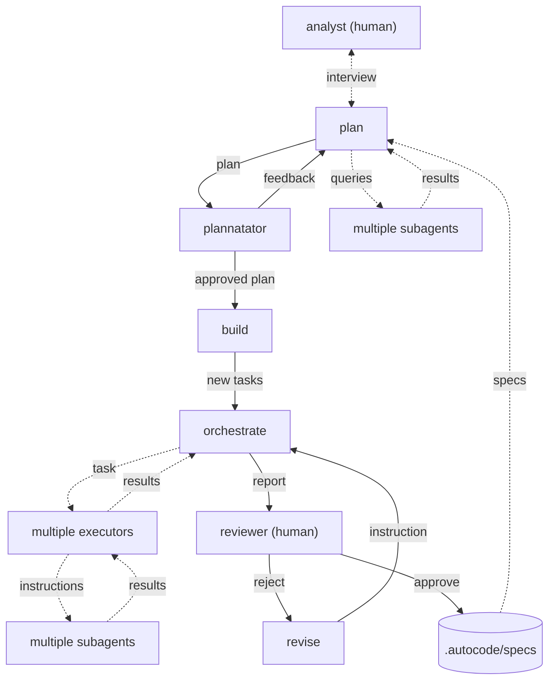

# Autocode

A file-based workflow orchestrator for [OpenCode](https://opencode.ai). Enables fire-and-forget AI task execution: approve a plan, walk away, and come back to review results.

## How It Works

Autocode introduces a structured workflow with 4 stages:

```
.autocode/
├── analyze/    # Add your idea .md files here
├── build/      # Plans being converted to tasks and executed
├── review/     # Completed plans awaiting your review
├── specs/      # Approved specs (registered as OpenCode skills)
└── .archive/   # Historical plan directories
```

### Workflow

1. **Analyze** — Add idea `.md` files to `.autocode/analyze/`
2. **Plan** — Run `/autocode-analyze` → interactive planning with OpenCode's plan agent
3. **Build** — Plan approval generates task directory structure with `build.prompt.md` and `test.prompt.md` files
4. **Orchestrate** — Autocode agent executes tasks sequentially/concurrently, retries failures, exports session logs
5. **Review** — Run `/autocode-review` → approve or reject completed work
6. **Specs** — Approved plans become OpenCode skills under `/plan-*` for future reference

## Installation & Usage

See [INSTALL.md](INSTALL.md) for detailed setup instructions (local dev, global install, npm).

Quick start:
```bash
cd ~/path/to/autocode
bun install
bun run src/install.ts --global  # symlink to ~/.config/opencode/
```

Then in your project:
```bash
opencode
# Run: /autocode-init
```

## Commands

| Command | Description |
|---------|-------------|
| `/autocode-init` | Initialize `.autocode/` directory in current project |
| `/autocode-analyze` | Pick an idea from `.autocode/analyze/` and start planning |
| `/autocode-resume` | Resume an interrupted build orchestration |
| `/autocode-review` | Review completed plans (approve/reject) |
| `/autocode-status` | Show status of all stages |
| `/autocode-abort` | Emergency abort all running tasks |

### Task Directory Structure

```
.autocode/build/<plan_name>/
├── plan.md              # Approved plan content
├── .review.md           # Review instructions (hidden until review)
├── .session.json        # Session IDs for resumability
├── awaiting/            # Tasks not yet started
│   ├── 0-first_task/    # Numbered = sequential (runs after all lower numbers)
│   │   ├── build.prompt.md
│   │   └── test.prompt.md
│   ├── 1-second_task/
│   │   ├── build.prompt.md
│   │   ├── test.prompt.md
│   │   ├── parallel_a/  # Unnumbered = parallel (runs concurrently)
│   │   └── parallel_b/  # Unnumbered = parallel (runs concurrently)
│   └── 2-third_task/
├── busy/                # Currently executing
└── tested/              # Completed & verified
```

### Task Ordering Rules

- **Numbered directories** (`0-xxx`, `1-xxx`, `2-xxx`, ..., `10-xxx`) execute **sequentially** in numeric order
- **Unnumbered directories** (no numeric prefix) execute **in parallel** with their siblings
- Sorting is **numeric** (0, 1, 2, ..., 9, 10, 11) — not alphabetic

## Architecture

### Idea to Implementation flow



### Core Components

- **Plugin** (`src/plugin.ts`) — OpenCode plugin entry point; initializes config and tool factories
- **Agents** (`src/agents/`) — `plan` (interview/research) and `build` (plan→tasks conversion)
- **Commands** (`src/commands/`) — CLI commands (`autocode-analyze`, `autocode-review`, etc.)
- **Tools** (`src/tools/`) — OpenCode tool implementations:
  - `session.ts` — session lifecycle (`spawn_session`)
  - `plan.ts` — plan analysis tools
  - `build.ts` — plan→task conversion tools
- **Core** (`src/core/`) — Configuration, types, and constants:
  - `config.ts` — async `loadConfig()` and sync `createConfig()`
  - `types.ts` — Zod enums for `Stage` and `TaskStatus`
- **Setup** (`src/setup.ts`) — Idempotent `.autocode/` directory initialization

### Tool Factories

Tools are created via closure-based dependency injection:
- `createSessionTools()` — session management
- `createAnalyzeTools()` — plan analysis
- `createBuildTools()` — plan→task conversion

Each factory captures the OpenCode client at plugin initialization.

### Common Utilities

All tools use shared validation, response helpers, and error formatting:

**Response Helpers** (`src/utils/validation.ts`):
- `successResponse()` — Returns result and resets retry counter
- `retryResponse()` — Returns retry error with escalation to abort after 5 attempts
- `abortResponse()` — Returns abort error for system failures

**Retry Tracking** (`src/utils/retry-tracker.ts`):
- Per-session retry counter with `MAX_RETRIES = 5`
- Automatic escalation from retry → abort when max retries exceeded
- Implicit reset when switching tools within a session

**Parameter Validators & Formatters** (`src/utils/validation.ts`):
- 6 validators for null-or-error-string pattern (non-empty, max words, length, format, alphanumeric)
- String formatters: `toIdentifier()` pipeline for normalizing plan names and identifiers

See [Common Utilities & Cross-Cutting Concerns](.Claude/skills/code/common/SKILL.md) for details.

### Error Handling

Autocode uses a unified error contract: all tools return `{ error: "..." }` JSON on failure.
- **Retry prefix** (`"Retry <tool> again..."`): agent provided bad input — fix and retry up to 5 times
- **Abort prefix** (`"You MUST abort..."`): internal system failure — stop immediately
- Distributed error handling (no custom exception hierarchy)
- `src/plugin.ts`: `.catch()` on `initAutocode` → `console.warn` (silent failure)
- `src/tools/session.ts`: NO try/catch — uses `throwOnError: true` (propagates errors)
- `src/core/config.ts`: bare `catch {}` silently falls back to defaults
- `failPlan()` helper moves failed plans to `.autocode/failed/` with idempotency guard

See [Error Handling](.Claude/skills/explore/error/SKILL.md) for the full error contract and [SECURITY.md](SECURITY.md) for authorization and input validation details.

## Development

```bash
# Install dependencies
bun install

# Run tests
bun test

# Watch mode
bun run watch

# Build (bundles + generates .d.ts)
bun run build
```
