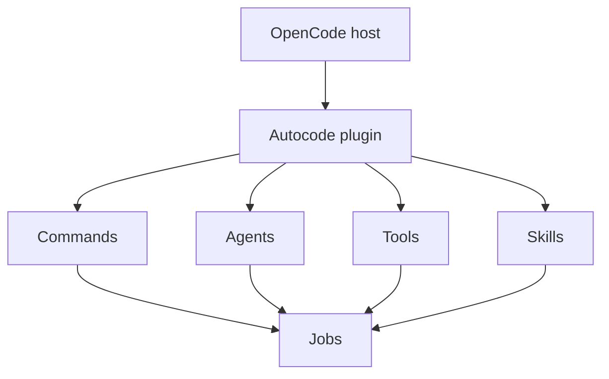
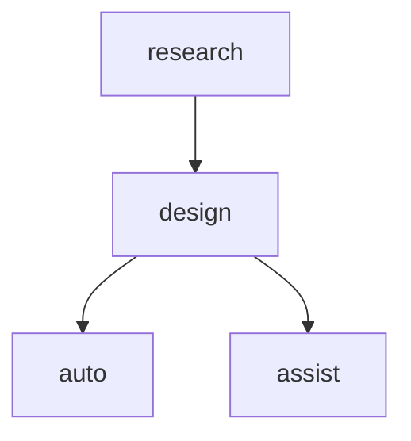
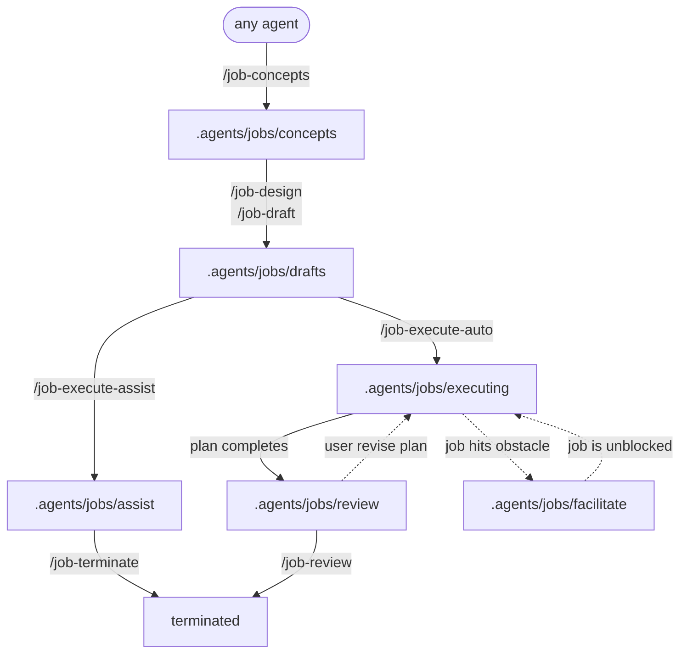
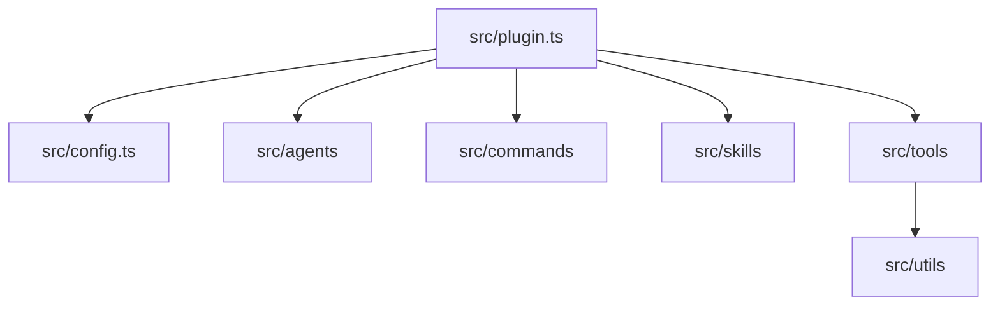

<p align="center"><span style="font-size: 96px; text-shadow: -3px -3px 0 #000, 3px -3px 0 #000, -3px  3px 0 #000, 3px 3px 0 #000, 0 -3px 0 #000, 0 3px 0 #000, -3px 0 0 #000, 3px 0 0 #000;">🤖</span></p>

<h1 align="center">Autocode</h1>

<p align="center">Autocode is an OpenCode plugin that bundles research, design, drafting, execution, review, termination, and documentation workflows into one curated plugin. It helps OpenCode users move from optional concepts and Research Reports into solution plans, then through assistive or autonomous job execution with traceable lifecycle state.</p>

---

## Features

- 🧭 **Concept-to-job workflow**: Moves work from optional concepts to drafted solution plans, then into assistive or autonomous execution with explicit review and termination stages.
- 📝 **Plan-save API**: Uses `autocode_plan_save` to create or update executable plans with canonical `Problem`, `Requirements`, `Constraints`, `Risks`, and `Proposed Solution` headings.
- ⚙️ **OpenCode configuration injection**: Registers managed agents, commands, generated skills, and runtime tools through the plugin config hook.
- 🧑‍💻 **Primary user agents**: Provides `research`, `design`, `auto`, and `assist` agents for evidence gathering, solution design, autonomous execution, and interactive execution.
- 🧩 **Specialist subagents**: Delegates focused work to `auto_*`, `query_*`, `execute_*`, and `document_*` subagents.
- 🗄️ **Read-only database inspection**: Exposes safe database discovery and single-table read tools, plus a `query_db` specialist for database research without write access.
- 📂 **Job lifecycle management**: Tracks concepts and planned jobs in canonical lifecycle directories `.agents/jobs/concepts`, `.agents/jobs/drafts`, `.agents/jobs/assist`, `.agents/jobs/executing`, `.agents/jobs/facilitate`, `.agents/jobs/review`, and `.agents/jobs/terminated`.
- ✅ **Lifecycle audit logging**: Stores active measurable `C*` criteria as flat id-to-metric mappings in the job's current canonical lifecycle directory; status changes and accepted criteria append guarded audit entries to `solution.md`.
- 🔐 **Centralised external directory control**: Shares one `permission.external_directory` rule map across agent external-directory access and the `task_external` cross-project handoff tool.
- 📝 **Documentation support**: Includes documentation commands and document-focused agents for README, AGENTS, conventions, technical design, installation, PRD, and UX updates.

## Integration

Autocode integrates with the OpenCode host as a plugin. OpenCode loads the built plugin, then Autocode injects its managed configuration and runtime tools.



## Installation

### Prerequisites

- [Bun](https://bun.sh) is required for dependency installation, builds, tests, and type checks.
- [OpenCode](https://opencode.ai) is required to load and use the plugin.

### Local setup

1. Install project dependencies from the repository root.

   ```bash
   bun install
   ```

   Bun installs the dependencies declared in [`package.json`](package.json).

2. Build the plugin.

   ```bash
   bun run build
   ```

   The build script removes `dist`, builds [`src/plugin.ts`](src/plugin.ts), emits TypeScript declarations, copies Markdown skill sources into `dist/skills`, and then runs [`scripts/install-plugin-shim.mjs`](scripts/install-plugin-shim.mjs). The shim writes an OpenCode plugin file under the current user's OpenCode plugin directory that re-exports the built `dist/plugin.js`.

3. Configure OpenCode to load the plugin according to your OpenCode plugin setup. The build installs a shim at `~/.config/opencode/plugins/autocode.js`, and for local development in this repository [`.opencode/plugin/autocode.ts`](.opencode/plugin/autocode.ts) re-exports the built plugin from `dist/plugin.js`.

### Development watch mode

Use watch mode while editing the plugin source.

```bash
bun run watch
```

The watch script copies Markdown skill sources once, then watches the Bun bundle and TypeScript declarations as source files change.

## Usage

Autocode is used from inside OpenCode after the plugin is loaded. It registers primary agents and workflow commands.

### Primary agents

| Agent      | Purpose                                                                     |
|------------|-----------------------------------------------------------------------------|
| `research` | Gather evidence and produce Research Reports.                               |
| `design`   | Design *solution plans* from conversation and optional Research Report data. |
| `auto`     | Autonomously executes drafted *jobs* from *solution plans*. |
| `assist`   | Interactively executes immediate tasks with human control (optionally using *solution plans* as guidance).                 |



### Workflow Commands

Normal prompts can start or resume jobs and provide review or completion decisions. Slash commands are compatibility/convenience wrappers, not required lifecycle gates.

| Command           | Purpose                                                                                                                                                       |
|-------------------|---------------------------------------------------------------------------------------------------------------------------------------------------------------|
| `/job-concepts`  | Creates *concept* Markdown files in `.agents/jobs/concepts/`.                                                                                                        |
| `/job-design`    | Design the *solution plan* from a selected *concept* or current planning context.                                                                             |
| `/job-draft`     | Save the *solution plan* as a *draft* in `.agents/jobs/drafts` for *job* execution approval.                                                                         |
| `/job-execute-assist` | Approve assistive *job* execution by moving it to `.agents/jobs/assist`.                                                                                             |
| `/job-execute-auto`   | Approve fully autonomous *job* execution by moving it to `.agents/jobs/executing`. Jobs that hit an obstacle move to `.agents/jobs/facilitate`, and completed jobs move to `.agents/jobs/review`. |
| `/job-review`    | User verified *review* will be committed to source control, then *terminated*.                                                                                |
| `/job-terminate` | Terminate a *solution plan* / *job* / *review* without committing to source control.                                                                          |                                                                         |

### Typical Job Workflow



1. You can optionally create *concepts* in `.agents/jobs/concepts`, either manually or by `/job-concepts`.
2. You can revise concept files if needed.
3. You run `/job-design` to design the *solution plan* from the selected context.
4. You run `/job-draft` to save the *solution plan* as a *draft* in `.agents/jobs/drafts` for execution approval.
5. You can revise *draft* in `.agents/jobs/drafts` if needed.

At this point you have a choice to run the *draft* fully autonomously or assistive (you stay in control).

#### Assistive Job Workflow

6. You run `/job-execute-assist` to move the *draft* into `.agents/jobs/assist` as a new *job*.
7. The `assist` agent will make recommendations based on the *solution plan* and track *job* progress, but you steer task execution.
8. Once done, the job can proceed to review or be closed with `/job-terminate`.

#### Autonomous Job Workflow

6. You run `/job-execute-auto` to approve the *draft* for autonomous execution by moving it to `.agents/jobs/executing`.
7. The `auto` agent will take over here and complete the designed *solution plan*.
8. If the `auto` agent hits an obstacle, you will be notified and the *job* will move to `.agents/jobs/facilitate`.
9. Once the *solution plan* completes, the `auto` agent will review its own work and produce a *review* in `.agents/jobs/review`.
10. You can then verify if the *review* and solution meet your expectations.
11. You can optionally revise the *solution plan* if necessary, or accept the solution with `/job-review`, which commits the changes to source control and cleans up the *job*.

### Job Directories

Jobs are located in `.agents/jobs/{status}/{job_name}/` directories, where `{status}` is one of `concepts`, `drafts`, `assist`, `executing`, `facilitate`, `review`, or `terminated`. In these directories are the following files:

| Path           | Purpose                                                                                                       |
|----------------|---------------------------------------------------------------------------------------------------------------|
| `concept.md`   | A copy of the original concept that for which the plan was designed.                                          |
| `criteria.yml` | Unmet acceptance criteria mappings to their `C*` codes.                                                       |
| `plan.md`      | Solution plan which defines the problem, requirements, constraints, risks and proposed a high-level solution. |
| `session.yml` | Keep track of Opencode session IDs for resume functionality.                                                  |
| `solution.md`  | Audit log that chronologically summarize how the solution was implemented.                                    |

### Handover Commands

| Command         | Purpose                                                                                                          |
|-----------------|------------------------------------------------------------------------------------------------------------------|
| `/new-research` | Creates a new research session that gathers evidence and produces a Research Report from recent context.         |
| `/new-design`   | Creates a new design session to propose the solution plan based on recent conversation and Research Report data. |
| `/new-assist`   | Creates a new assist session for to assistively implement a solution.                                            |
| `/new-auto`     | Creates a new auto session to autonomously implement a solution plan.                                            |

### Documentation Commands

| Command                 | Purpose                                                                              |
|-------------------------|--------------------------------------------------------------------------------------|
| `/document`             | Requests a comprehensive documentation update for the project.                       |
| `/document_conventions` | Documents naming conventions and terminology.                                        |
| `/document_design`      | Documents technical architecture and design decisions.                               |
| `/document_prd`         | Documents product requirements and user roles.                                       |
| `/document_ux`          | Documents UX flows, navigation, and styling patterns.                                |

### Utility Commands

| Command           | Purpose                                                                                                          |
|-------------------|------------------------------------------------------------------------------------------------------------------|
| `/git_commit`     | Creates a commit message and commits staged changes through the git commit subagent.                             |
| `/git_conflict`   | Handles git merge conflict work through the git conflict subagent.                                               |
| `/repeat_as_md`   | Repeats the last response inside a fenced Markdown code block.                                                   |
| `/repeat_as_wiki` | Repeats the last response in Atlassian Wiki Markup for Jira-style pasting.                                       |
| `/report-session` | Provides a detailed report for the entire current session.                                                       |
| `/report-task`    | Provides a detailed report for only the most recent user-requested assignment or task, ignoring earlier context. |
| `/resume`         | Resumes an interrupted session by calling the `task_resume` tool.                                                |

### Database inspection

Autocode can inspect environment-configured databases through read-only tools and the hidden `query_db` specialist agent. This capability is intended for safe lookup and analysis, not schema changes, joins across multiple tables, or write operations.

#### Safe read limits

- All DB access is read-only.
- Reads are limited to a single table at a time.
- Identifiers must be simple names only, such as schema, table, and field names.
- `autocode_db_table_read` supports `fields`, `filters`, `limit`, and one sort key only.
- `limit` accepts `1` to `100` and defaults to `7`.
- Supported filter operators are `=`, `!=`, `<`, `<=`, `>`, `>=`, `like`, `in`, and `is_null`.

#### Configuration

Set one database key per target connection using the following environment variable pattern:

| Variable                          | Required | Purpose                                                   |
| --------------------------------- | -------- | --------------------------------------------------------- |
| `AUTOCODE_DB_{db_key}_CONNECTION` | Yes      | Connection string used to detect the adapter and connect. |
| `AUTOCODE_DB_{db_key}_USERNAME`   | No       | Optional username override for the connection.            |
| `AUTOCODE_DB_{db_key}_PASSWORD`   | No       | Optional password override for the connection.            |

Replace `{db_key}` with letters, digits, or underscores. Environment lookup is case-insensitive at the tool input level and is normalised to uppercase for variable names.

## Configuration

Autocode reads optional JSONC configuration from the global OpenCode config first, then from the current project locations. Later candidates override earlier candidates per tier, so local worktree or directory settings can replace global defaults without copying the whole configuration.

### Configuration locations

| Precedence | Location                                                                             | Behaviour                                                                        |
| ---------- | ------------------------------------------------------------------------------------ | -------------------------------------------------------------------------------- |
| 1          | `~/.config/opencode/autocode.jsonc`                                                  | Global defaults considered earliest and used unless later config overrides them. |
| 2          | `.opencode/autocode.jsonc` in the OpenCode worktree                                  | Project or worktree settings override matching global tier values.               |
| 3          | `.opencode/autocode.jsonc` in the active directory, when different from the worktree | Directory-specific settings override matching worktree and global tier values.   |

Tier values can therefore be configured globally, for example with a `litellm` tier set, and selectively overridden in a local working directory, worktree, or nested directory config.

### External directory permission rules

Autocode also reads `permission.external_directory` from the same config locations and precedence chain. This central rule map is reused for both agent `external_directory` permissions and the `task_external` handoff tool.

OpenCode applies the **last matching rule wins** model, so place broad defaults first and more specific overrides later. When the same pattern key appears in a later config file, the later file overrides the earlier value for that pattern. Agents that can ask the user questions fall back to `ask` when no configured pattern matches; non-interactive agents fall back to `deny`.

| Key                               | Type   | Description                                                                                       | Default |
| --------------------------------- | ------ | ------------------------------------------------------------------------------------------------- | ------- |
| `permission.external_directory` | object | Map of absolute path patterns to `allow`, `ask`, or `deny` rules shared by agent and tool checks. | `{}`    |

For example:

```jsonc
{
  "permission": {
    "external_directory": {
      "/tmp/safe/**": "allow",
      "/tmp/safe/specific": "deny"
    }
  }
}
```

### Current configuration shape

| Key                             | Type   | Description                                                                                                                        | Default                                          |
| ------------------------------- | ------ | ---------------------------------------------------------------------------------------------------------------------------------- | ------------------------------------------------ |
| `autocode.tier`                 | string | Selects a named tier set from `autocode.tiers`, such as the sets shown in [`.opencode/autocode.jsonc`](.opencode/autocode.jsonc).  | No selected set.                                 |
| `autocode.tiers`                | object | Either a direct map of `cheap`, `fast`, `balanced`, and `smart` tier settings, or a map of named tier sets containing those tiers. | No overrides.                                    |
| `autocode.tiers.<tier>.model`   | string | Optional model override for a tier.                                                                                                | Uses the agent or OpenCode default when omitted. |
| `autocode.tiers.<tier>.variant` | string | Optional variant override for a tier.                                                                                              | Uses the agent or OpenCode default when omitted. |

Recognised model tiers are `cheap`, `fast`, `balanced`, and `smart`.

The `cheap` tier powers trivial Autocode operations, including the managed autocode dispatcher and compaction. When a configured `cheap.model` exists and the user top-level OpenCode `small_model` is absent, Autocode uses `cheap` as the `small_model` fallback for OpenCode title generation and compaction; explicit `small_model` and `agent.title` overrides are preserved.

For example:

```jsonc
"autocode": {
  "tier": "openai",
  "tiers": {
    "openai": {
      
      // Smart tier: used by auto, plan and other reasoning-heavy agents.
      "smart": {
        "model": "openai/gpt-5.5",
        "variant": "high"
      },
      
      // Balanced tier: used by assist, query, and execute subagents.
      "balanced": {
        "model": "openai/gpt-5.4",
        "variant": "medium"
      },
      
      // Fast tier: used by command dispatch and lightweight agents.
      "fast": {
        "model": "openai/gpt-5.3-spark",
        "variant": "low"
      },
      
      // Cheap tier: used for trivial tool-trigger operations.
      "cheap": {
        "model": "openai/gpt-5.4-mini",
        "variant": "low"
      }
    }
  }
}
```

### Database environment variables

Autocode also supports optional database inspection configuration through environment variables.

| Variable pattern                  | Description                                                                                                           | Default |
| --------------------------------- | --------------------------------------------------------------------------------------------------------------------- | ------- |
| `AUTOCODE_DB_{db_key}_CONNECTION` | Required connection string for one configured database target. Supported formats determine the adapter automatically. | None    |
| `AUTOCODE_DB_{db_key}_USERNAME`   | Optional username supplied alongside the connection when needed.                                                      | Unset   |
| `AUTOCODE_DB_{db_key}_PASSWORD`   | Optional password supplied alongside the connection when needed.                                                      | Unset   |

## Development

Autocode is a TypeScript OpenCode plugin/library. The plugin entry point is [`src/plugin.ts`](src/plugin.ts), which injects generated skills, loads global and local `autocode.jsonc` settings, derives shared external-directory permission rules, merges tier-specific agent model settings, registers managed agents, registers managed commands, and exposes runtime tools.



The managed agent catalogue lives in [`src/agents/index.ts`](src/agents/index.ts), and prompt templates live under [`src/agents/prompts/`](src/agents/prompts/). Commands are registered in [`src/commands/index.ts`](src/commands/index.ts) so the published package does not need separate command Markdown files. Bundled skill sources are Markdown files under `src/skills/<skill-name>/SKILL.md`, and `ensureGeneratedSkills` refreshes runtime-generated skills under `~/.agents/skills/autocode` before injecting the generated path into `skills.paths`. The `autocode` subdirectory is reserved for plugin-managed output; sibling directories under `~/.config/opencode/skills` are custom user skills.

Runtime tools live in [`src/tools/`](src/tools/). Current tools include Research Report listing and reading via legacy-named `autocode_concept_*` tools, plan creation, plan section reading and saving, job listing, job status updates, job start/resume, job acceptance and termination support, criteria set/list/remove, read-only database table discovery and single-table reads, logo discovery, cross-project task execution, and session resume support. Config loading in [`src/config.ts`](src/config.ts) merges global, worktree, and active-directory JSONC inputs so shared tier and permission rules can be overridden locally without copying the whole file.

The `task_external` custom tool resolves and canonicalises the requested target directory, asks OpenCode for `external_directory` permission using the shared rule map, then spawns a new OpenCode CLI session in another project or directory with `opencode run --dir` if access is allowed. Through normal CLI behaviour, the spawned session loads the target directory's OpenCode configuration, skills, MCPs, and `AGENTS.md`. Its required inputs are `target_directory` and `prompt`. The tool always runs the spawned session with the built-in `general` agent. Use it for cross-project or dependency investigation and edits where the target project context matters; avoid it when the current project context is sufficient.

### Sandbox execution

Linux sandbox execution requires usable bubblewrap (`bwrap`). Autocode does not use `proot` or `proot-distro` fallbacks.

Unsupported hosts/platforms are macOS, Windows, Android/Termux, non-Linux hosts, and Linux hosts without usable `bwrap` or user namespace support. During startup/configuration, after user config overrides are merged, unsupported hosts disable the `execute_sandbox` agent and force-deny `autocode_sandbox_create`, `autocode_sandbox_cli`, and `autocode_sandbox_delete`, including wildcard permission overrides.

Runtime diagnostics: missing or unusable `bwrap` means install or expose bubblewrap and ensure user namespaces work. Sandboxes whose metadata references legacy `proot` or `proot-distro` backends cannot run and should be recreated or migrated.

Security caveats: bubblewrap is the isolation mechanism; actual policy depends on explicit mounts and namespaces. Host kernel and user namespace support are security-relevant.

### Development commands

| Command             | Purpose                                                                                                                                              |
| ------------------- | ---------------------------------------------------------------------------------------------------------------------------------------------------- |
| `bun run build`     | Removes `dist`, builds `src/plugin.ts`, emits declarations, copies Markdown skill sources into `dist/skills`, and installs the OpenCode plugin shim. |
| `bun run watch`     | Copies Markdown skill sources once, then watches the Bun bundle and declarations as source files change.                                             |
| `bun test`          | Runs the Bun test suite.                                                                                                                             |
| `bun run typecheck` | Runs TypeScript type checking without emitting files.                                                                                                |

### Testing

The repository includes Bun tests for tools and generated skills under `src/**/*.test.ts`.

```bash
bun test
```

Review the Bun test summary in your terminal to confirm whether the suite passed.

### Building

Build the distributable plugin before loading it through the local shim or packaging it for use elsewhere.

```bash
bun run build
```

The build output is written to `dist/`, including `dist/plugin.js`, declarations, and copied Markdown skill sources under `dist/skills`, matching the `main`, `types`, and `exports` fields in [`package.json`](package.json).
