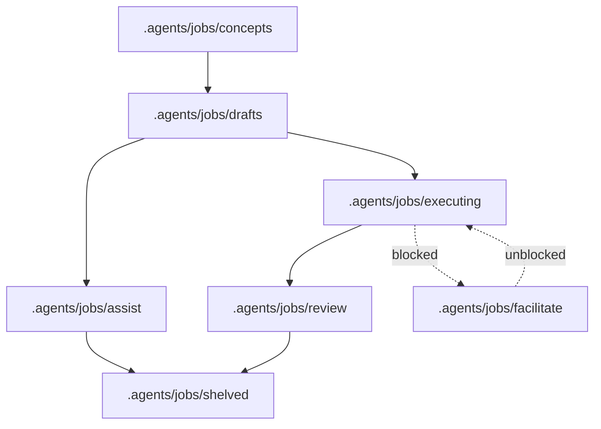

***The workflow engine for traceable autonomous job execution***


AutoCode is an OpenCode plugin that turns rough conceptual ideas into completed solutions by means of structured workflow phases and optional review gates.

Run jobs autonomously with **Auto mode**, or stay in control with **Assist mode**, where AutoCode does the safe hard work and separates dangerous operations into guided manual steps.

No special UI required. AutoCode runs in OpenCode, keeps progress in version-controllable text files, and lets you track multiple jobs across their full lifecycle making it the ideal solution for remote development or server administration.

---

## Features

- 🧭 **Structured lifecycle** — move researched work from concept to solution in phases: concept ➔ draft ➔ executing job ➔ review.
- 📚 **Self-learning memory** — auto capture corrections, environment quirks, permissions, and user preferences as skills for future sessions.
- ⚠️ **Safe hand-offs** — provide a thorough manual task tutorial when an operation is unsafe.
- 🪙 **Token-optimized workflows** — smart orchestrators delegate to faster specialists to improve performance and reduce token use.
- 🗄️ **Read-only database inspection** — discover configured database tables and read one table at a time without write access.
- 🧪 **Sandboxed execution** — run supported risky commands in Linux bubblewrap sandboxes when the host supports user namespaces.
- 📦 **Cross-project tasking** — delegate investigation or edits to isolated OpenCode sessions in other directories after permission checks.
- 🔐 **SSH tool suite** — run remote commands and manage files through environment-keyed tools.
- 🧹 **Agent cleanup** — agents remove temporary files and stop stray processes they started after debugging.

### Optimized Modes

- 🔎 **Research mode** — safely gather read-only evidence on project or non-project topics without making changes.
- 🧠 **Design mode** — brainstorm options, study feasibility, compare approaches, and report pros, cons, and risks before implementation starts.
- 🤖 **Auto mode** — execute approved drafted jobs autonomously while keeping progress and review evidence in version-controllable files.
- 🧑‍💻 **Assist mode** — keep a human in control while AutoCode reads the plan, recommends next steps, and tracks implementation progress.
- ✏️ **Edit mode** — make fast, targeted edits directly in-session without spawning subagents.

## Installation

### Prerequisites

- [OpenCode](https://opencode.ai) is required to load and use AutoCode.
- The npm package / plugin entry is `@ahumandev/autocode`.

#### Optional

- [Bubblewrap](https://github.com/containers/bubblewrap) is required only for Linux sandbox execution.
- [Bun](https://bun.sh) is required only to build the plugin from source or run tests.
- [chrome-devtools-mcp](https://github.com/ChromeDevTools/chrome-devtools-mcp) is required only for Chrome DevTools MCP server support.

### Installation for LLM Agents

Fetch installation guide and follow it:

```bash
curl -s https://raw.githubusercontent.com/ahumandev/autocode/refs/heads/main/docs/installation.md
```

### Installation for Humans

Follow this [installation guide](docs/index.md#installation-for-humans).

## Usage

AutoCode is an OpenCode plugin. It is not a standalone application and does not start a web server or expose a local URL. It registers managed agents, slash commands, generated skills, and tools.

### Primary Agents

| Agent      | Purpose                                                                                                 |
| ---------- | ------------------------------------------------------------------------------------------------------- |
| `research` | Gathers evidence and produces Research Reports.                                                         |
| `design`   | Creates solution plans from conversation and optional Research Report data.                             |
| `auto`     | Autonomously executes drafted jobs from solution plans.                                                 |
| `assist`   | Interactively executes immediate tasks with human control, optionally using solution plans as guidance. |

### Typical job workflow



1. Create or select a concept in `.agents/jobs/concepts`.
2. Run `/job-design` to create a solution plan from the selected concept or current planning context.
3. Run `/job-draft` to save the plan in `.agents/jobs/drafts/{job_name}/plan.md`.
4. Run `/job-execute-assist` to execute with human steering, or `/job-execute-auto` to execute autonomously.
5. Review the completed work from `.agents/jobs/review`.
6. Run `/job-review-commit` to accept (git commit) and shelve (clean up files) the job, or `/job-shelve` (alias `/shelve`) to close it without acceptance.

### Reference

- [Configuration](docs/configuration.md) — config locations, keys, model tiers, and DB/SSH environment variables.
- [Usage](docs/usage.md) — more details on how to use AutoCode.
- [Self Learned Skills](docs/skill.md) — reusable guidance files that extend AutoCode behavior.
- [Terminology](docs/terminology.md) — glossary of AutoCode concepts.

## Development

- [Development](development.md) — architecture, local setup, commands, testing, and local plugin deployment.
- [Distribution Guide](distribution.md) — distributing AutoCode on public registries.
