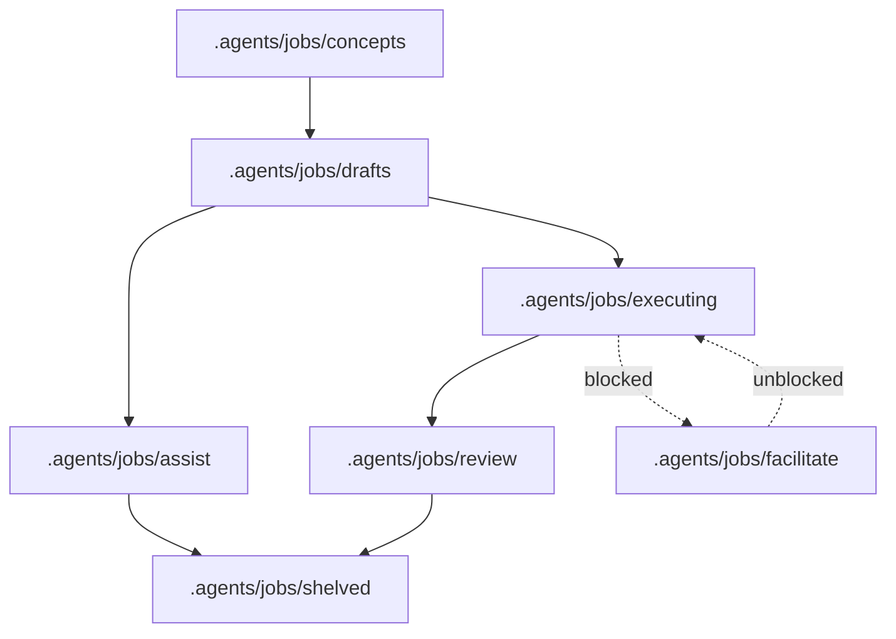
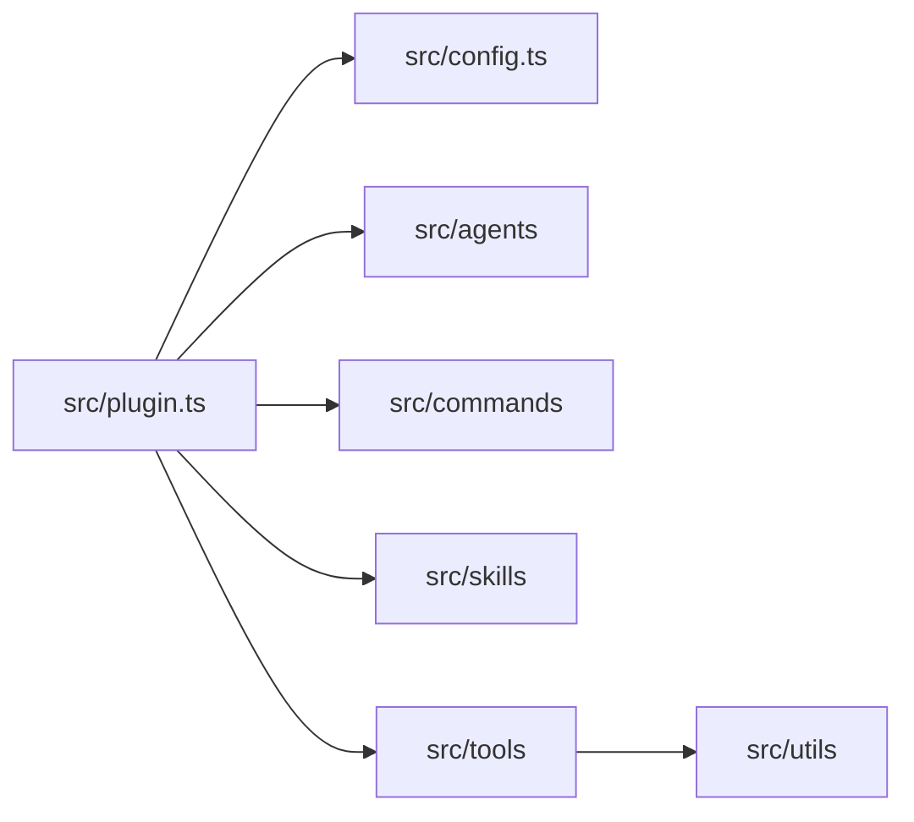

<p align="center"></p>

<h3 align="center">The workflow engine for traceable autonomous job execution</h3>

---

AutoCode is an OpenCode plugin that turns rough conceptual ideas into completed solutions by means of structured workflow phases and optional review gates.

Run jobs autonomously with **Auto mode**, or stay in control with **Assist mode**, where AutoCode does the safe hard work and separates dangerous operations into guided manual steps.

No special UI required. AutoCode runs in OpenCode, keeps progress in version-controllable text files, and lets you track multiple jobs across their full lifecycle making it the ideal solution for remote development or server administration.

---

## Features

- 🧭 **Structured lifecycle** — move researched work from concept to solution in phases: concept ➔ draft ➔ executing job ➔ review.
- 🧠 **Research-backed design** — use specialist agents to gather evidence, compare trade-offs, and prepare solution plans before implementation starts.
- 🤖 **Auto mode** — execute approved drafted jobs autonomously while keeping progress and review evidence in version-controllable files.
- 🧑‍💻 **Assist mode** — keep a human in control while AutoCode reads the plan, recommends next steps, and tracks implementation progress.
- ⚠️ **Safe hand-offs** — stop risky or blocked work and move it to facilitation instead of silently continuing with unsafe assumptions.
- ✅ **Acceptance criteria** — record measurable criteria and require unresolved criteria to be cleared before job acceptance.
- ⚡ **Token-optimized workflows** — smart orchestrators delegate to faster specialists to improve performance and reduce token use.
- 🗄️ **Read-only database inspection** — discover configured database tables and read one table at a time without write access.
- 🧪 **Sandboxed execution** — run supported risky commands in Linux bubblewrap sandboxes when the host supports user namespaces.
- 📦 **Cross-project tasking** — delegate investigation or edits to isolated OpenCode sessions in other directories after permission checks.
- 🔌 **OpenCode-native packaging** — register agents, commands, tools, and generated skills from one TypeScript plugin.

## Installation

### Prerequisites

- [OpenCode](https://opencode.ai) is required to load and use AutoCode.
- The npm package / plugin entry is `@ahumandev/autocode`.

#### Optional

- [Bubblewrap](https://github.com/containers/bubblewrap) is required only for Linux sandbox execution.
- [Bun](https://bun.sh) is required only to build the plugin from source or run tests.

### Installation for LLM Agents

Fetch installation guide and follow it:

```bash
curl -s https://raw.githubusercontent.com/ahumandev/autocode/refs/heads/main/docs/installation.md
```

### Installation for Humans

OpenCode installs npm plugins automatically at startup when they are listed in the global plugin configuration.

Use the global OpenCode config at `~/.config/opencode/opencode.json` or `~/.config/opencode/opencode.jsonc`, then merge the plugin entry into the existing `plugin` array instead of overwriting the file.

```json
{
  "plugin": ["@ahumandev/autocode"]
}
```

If your config already contains other plugins or settings, keep them and add `@ahumandev/autocode` to the existing array.

#### Verify installation

1. Save the updated OpenCode config.
2. Start or restart OpenCode.
3. Confirm OpenCode loads AutoCode commands or agents after startup.

See [`docs/installation.md`](docs/installation.md) for copy/paste installation, update, uninstall, and troubleshooting steps.

### Update the plugin version

To update the public package version, change the plugin entry to `@ahumandev/autocode@latest` in your OpenCode config, save the file, and restart OpenCode.

```jsonc
{
  "plugin": ["@ahumandev/autocode@latest"]
}
```

OpenCode re-installs the requested npm plugin version during startup.

### Uninstall

Remove `@ahumandev/autocode` from the OpenCode `plugin` array, save the config, and restart OpenCode.

If you previously used the repository-only shim workflow, also remove `~/.config/opencode/plugins/autocode.js`.

### Troubleshooting

- Confirm the config file is `~/.config/opencode/opencode.json` or `~/.config/opencode/opencode.jsonc`.
- Confirm your JSON or JSONC stays valid after merging the plugin entry.
- Confirm the plugin entry uses `@ahumandev/autocode` or `@ahumandev/autocode@latest` exactly.
- Restart OpenCode after every config change so startup installation can run again.

### Development watch mode

Use watch mode while editing plugin source files.

```bash
bun run watch
```

The watch script copies generated skill sources once, then watches the Bun bundle and TypeScript declarations as source files change.

## Usage

AutoCode is used from inside OpenCode after the plugin is loaded. It is not a standalone application and does not start a web server or expose a local URL. It registers managed agents, slash commands, generated skills, and tools.

### Primary Agents

| Agent      | Purpose                                                                                                 |
| ---------- | ------------------------------------------------------------------------------------------------------- |
| `research` | Gathers evidence and produces Research Reports.                                                         |
| `design`   | Creates solution plans from conversation and optional Research Report data.                             |
| `auto`     | Autonomously executes drafted jobs from solution plans.                                                 |
| `assist`   | Interactively executes immediate tasks with human control, optionally using solution plans as guidance. |

### Typical job workflow



1. Create or select a concept in `.agents/jobs/concepts`.
2. Run `/job-design` to create a solution plan from the selected concept or current planning context.
3. Run `/job-draft` to save the plan in `.agents/jobs/drafts/{job_name}/plan.md`.
4. Run `/job-execute-assist` to execute with human steering, or `/job-execute-auto` to execute autonomously.
5. Review the completed work from `.agents/jobs/review`.
6. Run `/job-review` to accept and shelve the job, or `/job-shelved` (alias `/shelve`) to close it without acceptance.

### Workflow commands

Normal prompts can start or resume work. Slash commands are convenience wrappers around the same lifecycle.

| Command               | Purpose                                                                                     |
| --------------------- | ------------------------------------------------------------------------------------------- |
| `/job-concepts`       | Saves concept Markdown files in `.agents/jobs/concepts/`.                                   |
| `/job-design`         | Designs a solution plan from a selected concept or current planning context.                |
| `/job-draft`          | Saves a solution plan as a draft in `.agents/jobs/drafts/{job_name}/plan.md`.               |
| `/job-execute`        | Selects and executes a job in the current session with either `auto` or `assist`.           |
| `/job-execute-assist` | Moves an approved draft to `.agents/jobs/assist/{job_name}/` and starts an assist session.  |
| `/job-execute-auto`   | Moves an approved draft to `.agents/jobs/executing/{job_name}/` and starts an auto session. |
| `/job-review`         | Accepts reviewed work, commits when applicable, and shelves the job.                        |
| `/job-shelved`        | Moves the current or selected job to `.agents/jobs/shelved/{job_name}/`.                    |
| `/shelve`             | Alias for `/job-shelved`.                                                                   |

### Handover commands

| Command             | Purpose                                                                  |
| ------------------- | ------------------------------------------------------------------------ |
| `/new-research`     | Creates a new research session from recent context.                      |
| `/new-design`       | Creates a new design session for a solution plan.                        |
| `/new-assist`       | Creates a new assist session for interactive implementation.             |
| `/new-auto`         | Creates a new auto session for autonomous implementation.                |
| `/new-troubleshoot` | Creates a new troubleshooting session from recent symptoms and evidence. |

### Documentation commands

| Command                 | Purpose                                                                |
| ----------------------- | ---------------------------------------------------------------------- |
| `/document`             | Document all recent changes.                                           |
| `/document-code`        | Documents recent technical architecture and code design decisions.     |
| `/document-conventions` | Documents recent naming conventions and project terminology.           |
| `/document-install`     | Document recent project installation steps changes.                    |
| `/document-prd`         | Documents recently updated product requirements and user roles.        |
| `/document-ux`          | Documents recently updated UX flows, navigation, and styling patterns. |
| `/init`                 | Documents the entire project.                                          |

### Utility commands

| Command           | Purpose                                                                              |
| ----------------- | ------------------------------------------------------------------------------------ |
| `/author-article` | Authors a professional article or report from the supplied context.                  |
| `/git-commit`     | Creates a commit message and commits staged changes through the git commit subagent. |
| `/git-conflict`   | Handles git merge conflict work through the git conflict subagent.                   |
| `/repeat-as-md`   | Repeats the last response inside a fenced Markdown code block.                       |
| `/repeat-as-wiki` | Repeats the last response in Atlassian Wiki Markup for Jira-style pasting.           |
| `/report-session` | Reports on the entire current session.                                               |
| `/report-task`    | Reports on only the most recent user-requested assignment.                           |
| `/resume`         | Resumes an interrupted session by calling the resume tool.                           |

### Job files

Jobs are stored in `.agents/jobs/{status}/{job_name}/`. The valid statuses are `concepts`, `drafts`, `assist`, `executing`, `facilitate`, `review`, and `shelved`.

| Path           | Purpose                                                                                       |
| -------------- | --------------------------------------------------------------------------------------------- |
| `concept.md`   | Copy of the concept used to design the plan.                                                  |
| `criteria.yml` | Acceptance criteria mappings with IDs such as `C1`, `C2`, and `C3`.                           |
| `plan.md`      | Solution plan covering problems, requirements, constraints, risks, and the selected proposal. |
| `session.yml`  | OpenCode session IDs used for resume functionality.                                           |
| `solution.md`  | Chronological implementation and audit log.                                                   |

### Database inspection

AutoCode can inspect environment-configured databases through read-only tools and the hidden database specialist agent. This capability is intended for safe lookup and analysis, not schema changes, joins across multiple tables, or write operations.

- All database access is read-only.
- Reads are limited to a single table at a time.
- Identifiers must be simple schema, table, or field names.
- Supported filter operators are `=`, `!=`, `<`, `<=`, `>`, `>=`, `like`, `in`, and `is_null`.

## Configuration

AutoCode reads optional JSONC configuration from global OpenCode configuration first, then from project locations. Later candidates override earlier candidates, so local worktree or directory settings can replace global defaults without copying the whole file.

### Configuration locations

| Precedence | Location                                                                             | Behaviour                                                                 |
| ---------- | ------------------------------------------------------------------------------------ | ------------------------------------------------------------------------- |
| 1          | `~/.config/opencode/autocode.jsonc`                                                  | Global defaults are considered first.                                     |
| 2          | `.opencode/autocode.jsonc` in the OpenCode worktree                                  | Project or worktree settings override matching global values.             |
| 3          | `.opencode/autocode.jsonc` in the active directory, when different from the worktree | Directory-specific settings override matching worktree and global values. |

### Configuration keys

| Key                                  | Type             | Description                                                                                                                        | Default                                          |
| ------------------------------------ | ---------------- | ---------------------------------------------------------------------------------------------------------------------------------- | ------------------------------------------------ |
| `autocode.tier`                      | string           | Selects a named tier set from `autocode.tiers`.                                                                                    | No selected set.                                 |
| `autocode.tiers`                     | object           | Either a direct map of `cheap`, `fast`, `balanced`, and `smart` tier settings, or a map of named tier sets containing those tiers. | No overrides.                                    |
| `autocode.tiers.<tier>.model`        | string           | Optional model override for a tier.                                                                                                | Uses the agent or OpenCode default when omitted. |
| `autocode.tiers.<tier>.variant`      | string           | Optional variant override for a tier.                                                                                              | Uses the agent or OpenCode default when omitted. |
| `permission.external_directory`      | object or string | Path-pattern permissions for external-directory access. Values are `allow`, `ask`, or `deny`.                                      | `{}`                                             |
| `autocode.sandbox.sync_method`       | string           | Sandbox sync strategy. Valid values are `auto`, `overlayfs`, `reflink`, and `copy`.                                                | Unset.                                           |
| `autocode.sandbox.distro.cache_path` | string           | Optional sandbox distribution cache path.                                                                                          | Unset.                                           |
| `autocode.sandbox.distro.expire`     | string or number | Optional sandbox distribution expiry value.                                                                                        | Unset.                                           |

Recognised model tiers are `cheap`, `fast`, `balanced`, and `smart`. The `cheap` tier is also used as the `small_model` fallback for OpenCode title generation and compaction when OpenCode has no explicit `small_model`.

For example:

```jsonc
{
  "autocode": {
    "tier": "openai",
    "tiers": {
      "openai": {
        "smart": { "model": "openai/gpt-5.5", "variant": "high" },
        "balanced": { "model": "openai/gpt-5.4", "variant": "medium" },
        "fast": { "model": "openai/gpt-5.3-spark", "variant": "low" },
        "cheap": { "model": "openai/gpt-5.4-mini", "variant": "low" }
      }
    }
  },
  "permission": {
    "external_directory": {
      "/tmp/safe/**": "allow",
      "/tmp/safe/specific": "deny"
    }
  }
}
```

OpenCode applies a last-matching-rule-wins model to external-directory permissions. Place broad defaults first and more specific overrides later.

### Database environment variables

| Variable pattern                  | Description                                                                                                           | Default |
| --------------------------------- | --------------------------------------------------------------------------------------------------------------------- | ------- |
| `AUTOCODE_DB_{db_key}_CONNECTION` | Required connection string for one configured database target. Supported formats determine the adapter automatically. | None.   |
| `AUTOCODE_DB_{db_key}_USERNAME`   | Optional username supplied alongside the connection when needed.                                                      | Unset.  |
| `AUTOCODE_DB_{db_key}_PASSWORD`   | Optional password supplied alongside the connection when needed.                                                      | Unset.  |

Replace `{db_key}` with letters, digits, or underscores. Environment lookup is case-insensitive. Then instruct agent to use your chosen `{db_key}` to access your DB.

## Development

AutoCode is a TypeScript OpenCode plugin/library. The plugin entry point is [`src/plugin.ts`](src/plugin.ts), which injects generated skills, loads configuration, derives external-directory permission rules, merges tier-specific agent model settings, registers managed agents, registers managed commands, and exposes runtime tools.



The managed agent catalogue lives in [`src/agents/index.ts`](src/agents/index.ts), and prompt templates live under [`src/agents/prompts/`](src/agents/prompts/). Commands are registered in [`src/commands/index.ts`](src/commands/index.ts), so the published package does not need separate command Markdown files. Generated skills are bundled from source during builds, and [`scripts/copy-skill-sources.mjs`](scripts/copy-skill-sources.mjs) copies them into `dist/skills`.

Runtime tools live in [`src/tools/`](src/tools/). They cover concept and plan management, job lifecycle updates, criteria tracking, read-only database discovery and table reads, sandbox lifecycle operations, cross-project task execution, and session resume support. Shared tool error handling should stay aligned with [`src/utils/tools.ts`](src/utils/tools.ts) and the agent error rules.

### Generated skills

Builds copy bundled skills into `dist/skills`, and the plugin can install the generated output for OpenCode under `~/.agents/skills/autocode/` or the equivalent XDG configuration location. Skills are knowledge files that OpenCode loads into AI context so agents and workflows can follow project-specific instructions; users do not need to invoke these files directly.

### Sandbox execution

Linux sandbox execution requires usable [Bubblewrap](https://github.com/containers/bubblewrap) (`bwrap`).

Sandbox tools include `autocode_sandbox_create`, `autocode_sandbox_cli`, `autocode_sandbox_delete`, `autocode_sandbox_read`, `autocode_sandbox_glob`, `autocode_sandbox_grep`, `autocode_sandbox_edit`, and `autocode_sandbox_copy`. Sandboxes expose `/sandbox` for writable work, `/home` for the sandbox home, and `/workspace` as a read-only project mount.

Unsupported hosts include macOS, Windows, Android or Termux, non-Linux systems, and Linux systems without usable `bwrap` or user namespace support. When sandboxing is unsupported, AutoCode disables the sandbox execution agent and force-denies sandbox create, CLI, delete, read, glob, grep, edit, and copy tools.

### Local setup

Local setup is for repository development only. It is not the public npm installation flow.

1. Install dependencies from the repository root.

   ```bash
   bun install
   ```

   Bun installs the dependencies declared in [`package.json`](package.json).

2. Build the plugin.

   ```bash
   bun run build
   ```

   The build removes `dist`, bundles [`src/plugin.ts`](src/plugin.ts), emits TypeScript declarations, copies generated skill sources, and runs [`scripts/install-plugin-shim.mjs`](scripts/install-plugin-shim.mjs).

3. Load the plugin in OpenCode.

   The build installs a shim at `~/.config/opencode/plugins/autocode.js`. This local shim is a developer workflow only. For local development in this repository, [`.opencode/plugin/AutoCode.ts`](.opencode/plugin/AutoCode.ts) re-exports the built plugin from `dist/plugin.js`.

### Development commands

| Command                         | Purpose                                                                                                                     |
| ------------------------------- | --------------------------------------------------------------------------------------------------------------------------- |
| `bun run build`                 | Removes `dist`, builds `src/plugin.ts`, emits declarations, copies generated skills, and installs the OpenCode plugin shim. |
| `bun run watch`                 | Copies generated skills once, then watches the Bun bundle and declarations as source files change.                          |
| `bun test`                      | Runs the Bun test suite under `src`.                                                                                        |
| `bun run typecheck`             | Runs TypeScript type checking without emitting files.                                                                       |
| `bun run verify:sandbox-online` | Runs the sandbox verification script.                                                                                       |

There is no `lint` script in the current `package.json`.

### Testing

The repository includes Bun tests for tools and generated skills under `src/**/*.test.ts`.

```bash
bun test
```

Review the Bun test summary in your terminal to confirm whether the suite passed.

Run TypeScript type checking separately.

```bash
bun run typecheck
```

TypeScript reports diagnostics if type checking fails, and exits successfully when no diagnostics are emitted.

### Local Plugin Deployment

Build the distributable plugin only for the local source workflow in this repository, when you are building AutoCode yourself and deploying or testing it locally through the local shim. This is not the npm publish or npm install workflow.

```bash
bun run build
```

The build output is written to `dist/`, including `dist/plugin.js`, declarations, and copied generated skills under `dist/skills`, matching the `main`, `types`, and `exports` fields in [`package.json`](package.json).

See [Distribution Guide](docs/distribution.md) for more information about distributing AutoCode on public registries.

## Terminology

| Term       | Definition                                                                           |
| ---------- | ------------------------------------------------------------------------------------ |
| Concept    | Early Markdown description of a desired change, saved before a solution plan exists. |
| Draft      | Approved solution plan saved under `.agents/jobs/drafts/{job_name}/`.                |
| Job        | A tracked unit of work that moves through AutoCode lifecycle directories.            |
| Facilitate | Blocked autonomous work that needs human help before it can continue safely.         |
| Shelved    | Closed job state used after accepted review or explicit shelving.                    |
