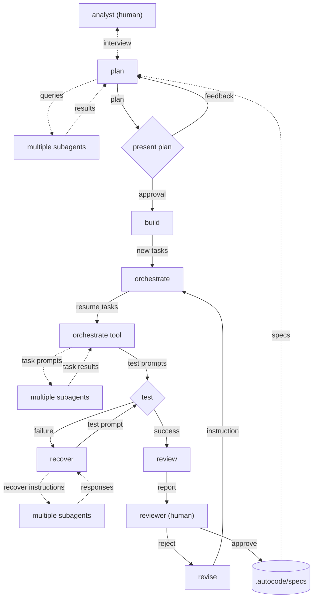

# Autocode

A Claude Code plugin that orchestrates fire-and-forget AI task execution via file-based workflows. Approve a plan, walk away, and come back to review results.

## How It Works

Autocode introduces a structured workflow with 4 stages:

```
.autocode/
├── analyze/    # Requirements that needs to be analyzed
├── build/      # Tasks being build from plans
├── failed/     # Plans that failed (required human intervention)
├── review/     # Tasks that succeeded (require human review)
├── specs/      # Approved specs (registered as OpenCode skills)
└── .archive/   # Historical plan directories
```

## Installation & Usage

See [INSTALL.md](INSTALL.md) for detailed setup instructions (local dev, global install, npm).

Quick start:
```bash
cd ~/path/to/autocode
bun install
bun run src/install.ts --global  # symlink to ~/.config/opencode/
```

Then in your project:
```bash
opencode
# Run: /autocode-init
```

## Commands

| Command                        | Description                                                      |
|--------------------------------|------------------------------------------------------------------|
| `/autocode-analyze`            | Pick an idea from `.autocode/analyze/` and start planning        |
| `/autocode-orchestrate-next`   | Execute next pending task or concurrent task group               |
| `/autocode-orchestrate-review` | Generate review report and move plan to `.autocode/review/`      |
| `/autocode-orchestrate-list`   | List plans in build, failed, and review stages                   |
| `/autocode-orchestrate-read`   | Read plan content, progress, task prompts, and results           |
| `/autocode-orchestrate-fix`    | Reconnect and send fix instructions to a failed task             |
| `/autocode-orchestrate-retry`  | Reconnect and retry a failed task                                |
| `/autocode-orchestrate-insert` | Insert a new task and shift subsequent tasks                     |
| `/autocode-orchestrate-move`   | Move a task to a new index                                       |
| `/autocode-orchestrate-delete` | Soft-delete a task directory                                     |

### Task Directory Structure

```
.autocode/{build|failed|review}/<plan_name>/
├── goal.md                    # Plan's goal
├── plan.md                    # Plan content
├── 00-first_task/             # Zero-padded, numbered = sequential
│   ├── background.md          # Task context (if provided)
│   ├── {agent}.prompt.md      # Agent execution instructions
│   ├── {agent}.session.{id}.md
│   ├── {agent}.result.{ts}.md
│   ├── verify.prompt.md         # Test verification instructions
│   ├── verify.session.{id}.md
│   └── verify.result.{ts}.md
├── 01-concurrent_group/       # Numbered group containing parallel tasks
│   ├── background.md
│   ├── parallel_a/            # Unnumbered = runs in parallel
│   │   ├── {agent}.prompt.md
│   │   └── ...
│   └── parallel_b/            # Unnumbered = runs in parallel
│       ├── {agent}.prompt.md
│       └── ...
└── 02-third_task/
```

### Task Ordering Rules

- **Numbered directories** (`00-xxx`, `01-xxx`, `02-xxx`, ...) execute **sequentially** in numeric order
- **Unnumbered subdirectories** within a numbered group execute **in parallel** with siblings
- Sorting is **numeric** (0, 1, 2, ..., 9, 10, 11) — not alphabetic
- **In-flight state**: `timestamp_NN-task_name` (directory being executed)
- **Succeeded state**: `.timestamp_NN-task_name` (hidden directory, dot-prefixed)
- **Failed state**: `timestamp_NN-task_name.failed` (directory with `.failed` suffix)

## Architecture

### Idea to Implementation flow



### Core Components

- **Plugin** (`src/plugin.ts`) — Claude Code plugin entry point; initializes config and tool factories
- **Agents** (`src/agents/`) — `plan`, `build`, `orchestrate`, and `recover` agents
- **Agent Prompts** (`src/agents/prompts/`) — Prompt files for each agent
- **Commands** (`src/commands/`) — CLI command definitions
- **Tools** (`src/tools/`) — Claude Code tool implementations:
  - `analyze.ts` — analyze tools (`autocode_analyze_list`, `autocode_analyze_read`)
  - `build.ts` — build tools (`autocode_build_plan`, `autocode_build_next_task`, `autocode_build_concurrent_task`, `autocode_build_orchestrate`, `autocode_build_fail`)
  - `orchestrate.ts` — orchestrate tools (task execution, progress tracking, review generation)
  - `session.ts` — session lifecycle (`spawn_session`)
- **Core** (`src/core/`) — Configuration, types, and constants:
  - `config.ts` — async `loadConfig()` and sync `createConfig()`
  - `types.ts` — Zod enums for `Stage` and `TaskStatus`
- **Setup** (`src/setup.ts`) — Idempotent `.autocode/` directory initialization

### Tool Factories

Tools are created via closure-based dependency injection:
- `createAnalyzeTools()` — analyze tools
- `createBuildTools()` — build tools
- `createOrchestrateTools()` — orchestrate tools
- `createSessionTools()` — session management

Each factory captures the Claude Code client at plugin initialization.

### Common Utilities

All tools use shared validation, response helpers, and error formatting:

**Response Helpers** (`src/utils/validation.ts`):
- `successResponse()` — Returns result and resets retry counter
- `retryResponse()` — Returns retry error with escalation to abort after 5 attempts
- `abortResponse()` — Returns abort error for system failures

**Retry Tracking** (`src/utils/retry-tracker.ts`):
- Per-session retry counter with `MAX_RETRIES = 5`
- Automatic escalation from retry → abort when max retries exceeded
- Implicit reset when switching tools within a session

**Parameter Validators & Formatters** (`src/utils/validation.ts`):
- Validators for null-or-error-string pattern (non-empty, max words, length, format, alphanumeric)
- String formatters: `toIdentifier()` pipeline for normalizing plan names and identifiers

**Task Utilities** (`src/utils/tasks.ts`):
- `findNextGroup()` — locate next pending task or concurrent group
- `collectTasks()` — gather all tasks from a plan directory
- `formatSessionMarkdown()` — format agent session transcripts
- `extractLastMessage()` — extract final message from session
- `extractTaskResult()` — parse task result (last `<success>` or `<failure>` tag wins)
- `buildReviewMarkdown()` — generate review report from completed tasks

### Error Handling

Autocode uses a unified error contract: all tools return `{ error: "..." }` JSON on failure.
- **Retry prefix** (`"Retry <tool> again..."`): agent provided bad input — fix and retry up to 5 times
- **Abort prefix** (`"You MUST abort..."`): internal system failure — stop immediately
- Distributed error handling (no custom exception hierarchy)
- Per-session retry tracker with `MAX_RETRIES = 5`; escalates from retry → abort when exceeded
- Task failures tracked via filesystem directory renames and `failure.md` markers
- **Silent failures** (intentional):
  - `src/plugin.ts`: `.catch()` on `initAutocode` → `console.warn`
  - `src/core/config.ts`: bare `catch {}` silently falls back to defaults
- **Exception to the rule**: `src/tools/session.ts` uses `throwOnError: true` (propagates errors)

See [SECURITY.md](SECURITY.md) for authorization and input validation details.

## Development

```bash
# Install dependencies
bun install

# Run tests
bun test

# Watch mode
bun run watch

# Build (bundles + generates .d.ts)
bun run build
```
