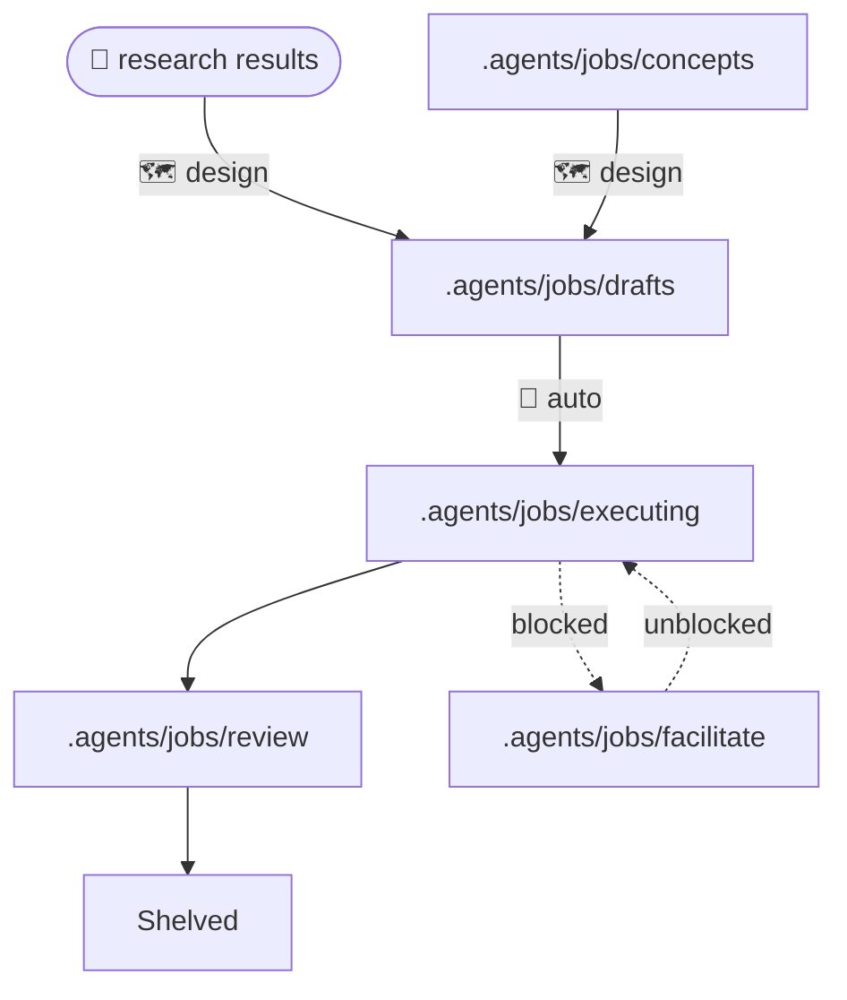
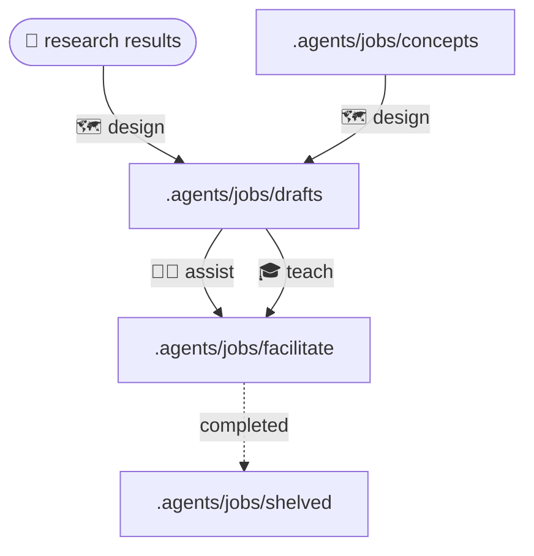

## Features

- 🧭 **Structured lifecycle** — move work through drafts, facilitate or executing, review, and shelved phases.
- 📚 **Self-learning memory** — auto capture corrections, environment quirks, permissions, and user preferences as skills for future sessions.
- ⚠️ **Safe hand-offs** — provide a thorough manual task tutorial when an operation is unsafe.
- 🪙 **Token-optimized workflows** — smart orchestrators delegate to faster specialists to improve performance and reduce token use.
- 🗄️ **Read-only database inspection** — discover configured database tables and read one table at a time without write access.
- 🧪 **Sandboxed execution** — run supported risky commands in Linux bubblewrap sandboxes when the host supports user namespaces.
- 📦 **Cross-project tasking** — delegate investigation or edits to isolated OpenCode sessions in other directories after permission checks.
- 🔐 **SSH tool suite** — run remote commands and manage files through environment-keyed tools.
- 🧹 **Agent cleanup** — agents remove temporary files and stop stray processes they started after debugging.

## Installation

### Prerequisites

- [OpenCode](https://opencode.ai) is required to load and use AutoCode.
- The npm package / plugin entry is `@ahumandev/autocode`.

#### Optional

- [Bubblewrap](https://github.com/containers/bubblewrap) is required only for Linux sandbox execution.
- [Bun](https://bun.sh) is required only to build the plugin from source or run tests.
- [chrome-devtools-mcp](https://github.com/ChromeDevTools/chrome-devtools-mcp) is required only for Chrome DevTools MCP server support.

### Installation for LLM Agents

Fetch installation guide and follow it:

```bash
curl -s https://raw.githubusercontent.com/ahumandev/autocode/refs/heads/main/docs/installation.md
```

### Installation for Humans

Follow this [installation guide](docs/index.md#installation-for-humans).

## Usage

AutoCode is an OpenCode plugin. It is not a standalone application and does not start a web server or expose a local URL. It registers managed agents, slash commands, generated skills, and tools.

### Primary Agents

|     | Agent      | Purpose                                                                     |
| --- | ---------- | --------------------------------------------------------------------------- |
| 🔎   | `research` | Gathers evidence and produces Research Reports.                             |
| 🧠   | `design`   | Creates solution plans from conversation and optional Research Report data. |
| 🤖   | `auto`     | Autonomously executes drafted jobs from solution plans.                     |
| 🧑‍💻   | `assist`   | Interactively executes immediate tasks with human control                   |
| ✏️   | `edit`     | Make fast, targeted edits directly in-session without spawning subagents    |
| 🎓   | `teach`    | Find answer and teach how to manually fix problems |

### Autonomous Job Workflow


```mermaid
flowchart TD
  Research([🔎 research results]) --🗺️ design--> Drafts[.agents/jobs/drafts]
  Concepts[ .agents/jobs/concepts] --🗺️ design--> Drafts
  Drafts --🤖 auto --> Executing[.agents/jobs/executing]
  Executing --> Review[.agents/jobs/review]
  Review --> Shelved
  Executing -.blocked.-> Facilitate[.agents/jobs/facilitate]
  Facilitate -.unblocked.-> Executing
```

1. 🔎 `research` possibilities or create concept md document in `.agents/jobs/concepts`.
2. Run `/job-design` to investigate feasibility, design best approach and draft solution plan in `.agents/jobs/drafts/{job_name}/plan.md`.
3. Revise draft `plan.md` before autonomous handover.
4. Run `/job-execute` to execute `plan.md` fully autonomously.
5. The job will move automatically to `.agents/jobs/executing` while busy, `.agents/jobs/facilitate` if blocked and then to `.agents/jobs/review` when done.
6. When done, do manual testing, then:
   - *Reject* job with `/job-shelve` to shelve (clean up files) job or
   - *Accept* job with `/commit` to commit to git and shelve.

### Assisted Workflow


```mermaid
flowchart TD
  Research([🔎 research results]) --🗺️ design--> Drafts[.agents/jobs/drafts]
  Concepts[ .agents/jobs/concepts] --🗺️ design--> Drafts
  Drafts --🧑‍💻 assist --> Facilitate[.agents/jobs/facilitate]
  Drafts --🎓 teach --> Facilitate
  Facilitate -.completed.-> Shelved[.agents/jobs/shelved]
```

1. 🔎 `research` possibilities or create concept md document in `.agents/jobs/concepts`.
2. Run `/job-design` to investigate feasibility, design best approach and draft solution plan in `.agents/jobs/drafts/{job_name}/plan.md`.
3. Run one of these commands:
   - `/job-facilitate`: Execute `plan.md` semi-autonomously with assistant (you make decisions, assistant do work).
   - `/job-teach`: Execute `plan.md` manually with guiding teacher.
5. If `/job-execute` was chosen, then job will move automatically to `.agents/jobs/executing` while busy and then to `.agents/jobs/review` when done.
6. When done, do manual testing, then:
   - *Reject* job with `/job-shelve` to shelve (clean up files) job or
   - *Accept* job with `/commit` to commit to git and shelve.

### Hybrid Workflow

Combinations of Autonomous and Assisted Workflows are also possible as you can switch any time between `auto`, `assist`, `teach` agents.

For example you may start in `assist` mode and then later when you get busy, switch to `auto` mode so that agent can continue with your plan without your presence or vice versa.

## Reference

- [Configuration](docs/configuration.md) — config locations, keys, model tiers, and DB/SSH environment variables.
- [Usage](docs/usage.md) — more details on how to use AutoCode.
- [Self Learned Skills](docs/skill.md) — reusable guidance files that extend AutoCode behavior.
- [Terminology](docs/terminology.md) — glossary of AutoCode concepts.

## Development

- [Development](development.md) — architecture, local setup, commands, testing, and local plugin deployment.
- [Distribution Guide](distribution.md) — distributing AutoCode on public registries.
