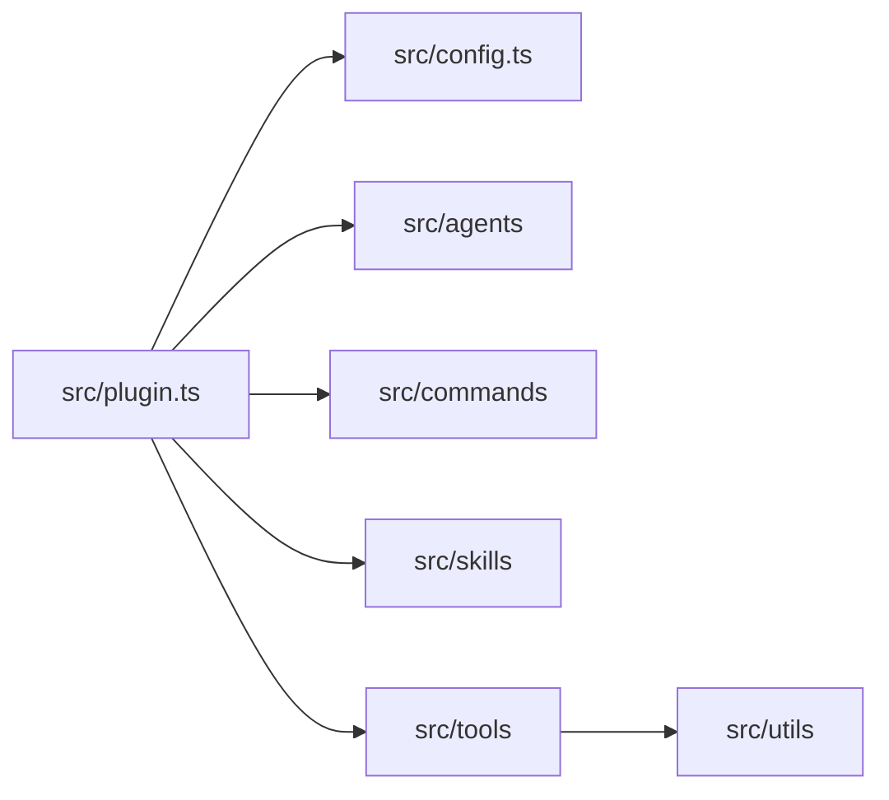

# Development

AutoCode is a TypeScript OpenCode plugin/library. The plugin entry point is [`src/plugin.ts`](../src/plugin.ts), which injects generated skills, loads configuration, derives external-directory permission rules, merges tier-specific agent model settings, registers managed agents, registers managed commands, and exposes runtime tools.



The managed agent catalogue lives in [`src/agents/index.ts`](../src/agents/index.ts), and prompt templates live under [`src/agents/prompts/`](../src/agents/prompts/). Commands are registered in [`src/commands/index.ts`](../src/commands/index.ts), so the published package does not need separate command Markdown files. Generated skills are bundled from source during builds, and [`scripts/copy-skill-sources.ts`](../scripts/copy-skill-sources.ts) copies them into `dist/skills`.

Runtime tools live in [`src/tools/`](../src/tools/). They cover concept and plan management, job lifecycle updates, criteria tracking, read-only database discovery and table reads, REST requests and cached response lookup, sandbox lifecycle operations, cross-project task execution, and session resume support. Shared tool error handling should stay aligned with [`src/utils/tools.ts`](../src/utils/tools.ts) and the agent error rules.

## Generated skills

Builds copy bundled skills and tracked GitHub snapshots into `dist/skills`, and the plugin can install the generated output for OpenCode under `~/.agents/skills/autocode/` or the equivalent [XDG](https://specifications.freedesktop.org/basedir/latest/) configuration location. Skills are knowledge files that OpenCode loads into AI context so agents and workflows can follow project-specific instructions; users do not need to invoke these files directly.

### GitHub skill snapshots

Run `bun run skill:sync` to refresh GitHub skill snapshots. It uses the primary cache at `~/.cache/autocode/github/<owner>/<project>/` and may falls back to `.opencode/autocode/cache/github/<owner>/<project>/` on failure. Both cache trees are disposable and safe to delete. Sync reads [`src/skills/github.jsonc`](../src/skills/github.jsonc) and writes tracked snapshots to `src/skills/github/{owner}/{project}/{skill}`. Review every sync change in Git before commit.

Run `bun run skill:sync -- --force-refresh` to bypass cached repositories and refresh them remotely.

Run `bun run build` to copy committed skill snapshots from `src/skills` into `dist` (the package directory shipped to users). Autocode plugin startup extracts only these local bundled files and never clones, symlinks, or fetches skills.

Legal files retain their original names in `github/{owner}/{project}/`. Projects under one owner can have different legal files. Sync warns when a repository-root license is missing. Syncing accepts redistribution risk and grants no rights.

## Sandbox execution

Linux sandbox execution requires usable [Bubblewrap](https://github.com/containers/bubblewrap) (`bwrap`).

Sandbox tools include `autocode_sandbox_create`, `autocode_sandbox_cli`, `autocode_sandbox_delete`, `autocode_sandbox_read`, `autocode_sandbox_glob`, `autocode_sandbox_grep`, `autocode_sandbox_edit`, and `autocode_sandbox_copy`. Sandboxes expose `/sandbox` for writable work, `/home` for the sandbox home, and `/workspace` as a read-only project mount.

Unsupported hosts include macOS, Windows, Android or Termux, non-Linux systems, and Linux systems without usable `bwrap` or user namespace support. When sandboxing is unsupported, AutoCode disables the sandbox execution agent and force-denies sandbox create, CLI, delete, read, glob, grep, edit, and copy tools.

## Local setup

Local setup is for repository development only. It is not the public npm installation flow.

1. Install dependencies from the repository root.

   ```bash
   bun install
   ```

   Bun installs the dependencies declared in [`package.json`](../package.json).

2. Build the plugin.

   ```bash
   bun run build
   ```

   The build removes `dist`, bundles [`src/plugin.ts`](../src/plugin.ts), emits TypeScript declarations, and copies generated skills and GitHub snapshots into `dist/`. It does not install the local shim.

3. Install the local shim when you want OpenCode to load the repository build.

   ```bash
   bun run install:shim
   ```

   This writes the local development shim to `~/.config/opencode/plugins/autocode.js`.

4. Load the plugin in OpenCode.

   For local development in this repository, [`.opencode/plugin/autocode.ts`](../.opencode/plugin/autocode.ts) re-exports the built plugin from `dist/plugin.js`.

## Development commands

| Command                         | Purpose                                                                                                                          |
| ------------------------------- | -------------------------------------------------------------------------------------------------------------------------------- |
| `bun run build`                 | Removes `dist`, builds `src/plugin.ts`, emits declarations, and copies generated skills and GitHub snapshots into `dist/`. Does not install the shim. |
| `bun run install:shim`          | Installs the local development shim at `~/.config/opencode/plugins/autocode.js`.                                                 |
| `bun run watch`                 | Copies generated skills once, then watches the Bun bundle and declarations as source files change.                               |
| `bun run skill:sync`            | Refreshes tracked GitHub skill snapshots; review Git changes before commit.                                                       |
| `bun test`                      | Runs the Bun test suite under `src`.                                                                                             |
| `bun run typecheck`             | Runs TypeScript type checking without emitting files.                                                                            |
| `bun run verify:sandbox-online` | Runs the sandbox verification script.                                                                                            |

There is no `lint` script in the current `package.json`.

## Testing

The repository includes Bun tests for tools and generated skills under `src/**/*.test.ts`.

```bash
bun test
```

Review the Bun test summary in your terminal to confirm whether the suite passed.

Run TypeScript type checking separately.

```bash
bun run typecheck
```

TypeScript reports diagnostics if type checking fails, and exits successfully when no diagnostics are emitted.

## Local Plugin Deployment

Build the distributable plugin only for the local source workflow in this repository, when you are building AutoCode yourself and deploying or testing it locally through the local shim. This is not the npm publish or npm install workflow.

```bash
bun run build
bun run install:shim
```

The build output is written to `dist/`, including `dist/plugin.js`, declarations, and copied generated skills under `dist/skills`, matching the `main`, `types`, and `exports` fields in `package.json`. Run `bun run install:shim` separately when you need the local OpenCode shim.

See [Distribution Guide](distribution.md) for more information about distributing AutoCode on public registries.
