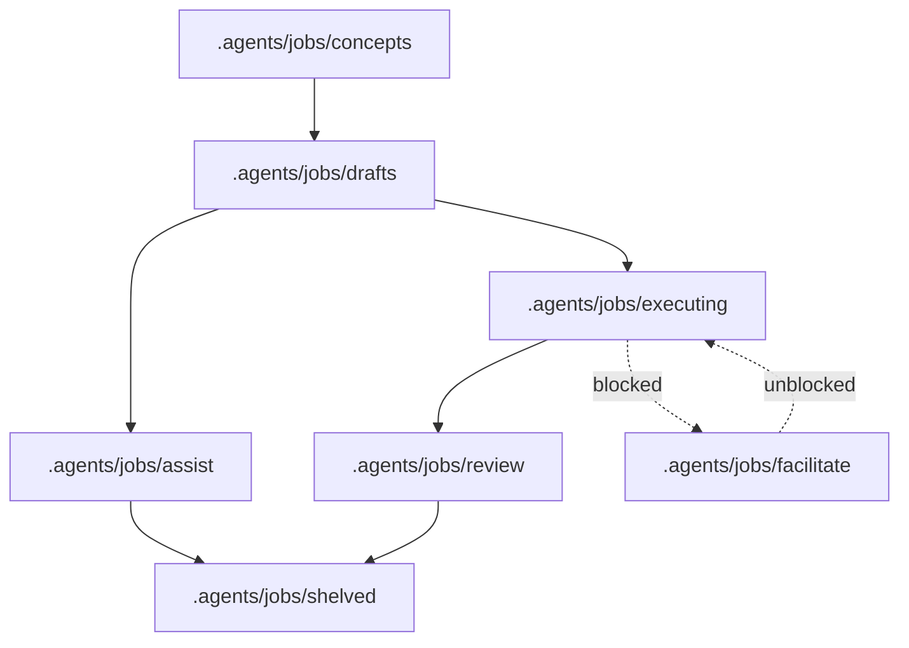

# Usage

AutoCode is used from inside OpenCode after the plugin is loaded. It is not a standalone application and does not start a web server or expose a local URL. It registers managed agents, slash commands, generated skills, and tools.

### Primary Agents

| Agent      | Purpose                                                                                                 |
| ---------- | ------------------------------------------------------------------------------------------------------- |
| `research` | Gathers evidence and produces Research Reports.                                                         |
| `design`   | Creates solution plans from conversation and optional Research Report data.                             |
| `auto`     | Autonomously executes drafted jobs from solution plans.                                                 |
| `assist`   | Interactively executes immediate tasks with human control, optionally using solution plans as guidance. |

### Typical job workflow

1. Create or select a concept in `.agents/jobs/concepts`.
2. Run `/job-design` to create a solution plan from the selected concept or current planning context.
3. Run `/job-draft` to save the plan in `.agents/jobs/drafts/{job_name}/plan.md`.
4. Run `/job-execute-assist` to execute with human steering, or `/job-execute-auto` to execute autonomously.
5. Review the completed work from `.agents/jobs/review`.
6. Run `/job-review-commit` to accept (git commit) and shelve (clean up files) the job, or `/job-shelve` (alias `/shelve`) to close it without acceptance.

### Workflow commands

Normal prompts can start or resume work. Slash commands are convenience wrappers around the same lifecycle.

| Command               | Purpose                                                                                     |
| --------------------- | ------------------------------------------------------------------------------------------- |
| `/job-concepts`       | Saves concept Markdown files in `.agents/jobs/concepts/`.                                   |
| `/job-design`         | Designs a solution plan from a selected concept or current planning context.                |
| `/job-draft`          | Saves a solution plan as a draft in `.agents/jobs/drafts/{job_name}/plan.md`.               |
| `/job-execute`        | Selects and executes a job in the current session with either `auto` or `assist`.           |
| `/job-execute-assist` | Moves an approved draft to `.agents/jobs/assist/{job_name}/` and starts an assist session.  |
| `/job-execute-auto`   | Moves an approved draft to `.agents/jobs/executing/{job_name}/` and starts an auto session. |
| `/job-review-commit`  | Accepts reviewed work, commits when applicable, and shelves the job.                        |
| `/job-shelve`         | Moves the current or selected job to `.agents/jobs/shelved/{job_name}/`.                    |

### Handover commands

| Command             | Purpose                                                                  |
| ------------------- | ------------------------------------------------------------------------ |
| `/new-research`     | Creates a new research session from recent context.                      |
| `/new-design`       | Creates a new design session for a solution plan.                        |
| `/new-assist`       | Creates a new assist session for interactive implementation.             |
| `/new-auto`         | Creates a new auto session for autonomous implementation.                |
| `/new-troubleshoot` | Creates a new troubleshooting session from recent symptoms and evidence. |

### Documentation commands

| Command             | Purpose                                                                |
| ------------------- | ---------------------------------------------------------------------- |
| `/docs`             | Document all recent changes.                                           |
| `/docs-code`        | Documents recent technical architecture and code design decisions.     |
| `/docs-conventions` | Documents recent naming conventions and project terminology.           |
| `/docs-prd`         | Documents recently updated product requirements and user roles.        |
| `/docs-ux`          | Documents recently updated UX flows, navigation, and styling patterns. |
| `/init`             | Documents the entire project.                                          |

### Utility commands

| Command             | Purpose                                                                              |
| ------------------- | ------------------------------------------------------------------------------------ |
| `/autocode-version` | Prints currently installed versions of OpenCode and AutoCode.                        |
| `/author-article`   | Authors a professional article or report from the supplied context.                  |
| `/context`          | Report current session context.                                                      |
| `/explain`          | Explain code or project context.                                                     |
| `/fix`              | Fix errors or requested issues.                                                      |
| `/git-commit`       | Creates a commit message and commits staged changes through the git commit subagent. |
| `/git-conflict`     | Handles git merge conflict work through the git conflict subagent.                   |
| `/repeat-as-md`     | Repeats the last response inside a fenced Markdown code block.                       |
| `/repeat-as-wiki`   | Repeats the last response in Atlassian Wiki Markup for Jira-style pasting.           |
| `/report`           | Summarize session as report.                                                         |
| `/resume`           | Resumes an interrupted session by calling the resume tool.                           |
| `/shelve`           | Clean up sandbox files (if any). Alias for `/job-shelve`.                            |
| `/tests`            | Generate or improve tests.                                                           |

### Job files

Jobs are stored in `.agents/jobs/{status}/{job_name}/`. The valid statuses are `concepts`, `drafts`, `assist`, `executing`, `facilitate`, `review`, and `shelved`.

| Path           | Purpose                                                                                       |
| -------------- | --------------------------------------------------------------------------------------------- |
| `concept.md`   | Copy of the concept used to design the plan.                                                  |
| `criteria.yml` | Acceptance criteria mappings with IDs such as `C1`, `C2`, and `C3`.                           |
| `plan.md`      | Solution plan covering problems, requirements, constraints, risks, and the selected proposal. |
| `session.yml`  | OpenCode session IDs used for resume functionality.                                           |
| `solution.md`  | Chronological implementation and audit log.                                                   |

### Database inspection

AutoCode can inspect environment-configured databases through read-only tools and the hidden database specialist agent. This capability is intended for safe lookup and analysis, not schema changes, joins across multiple tables, or write operations.

- All database access is read-only.
- Reads are limited to a single table at a time.
- Identifiers must be simple schema, table, or field names.
- Supported filter operators are `=`, `!=`, `<`, `<=`, `>`, `>=`, `like`, `in`, and `is_null`.

### REST response lookup

AutoCode can also make bounded REST requests and cache long responses for later lookup inside the current job.

- When the response body exceeds 400 characters, AutoCode caches it under the current job `rest/` directory and includes `response_name`, `job_name`, and guidance in the returned output.
- Cache filename shape: `{timestamp}_{METHOD}_{protocol}_{host-and-credentials}_{encoded-path}.json`.
- Binary or non-UTF-8 responses are decoded into readable UTF-8 replacement text.

Cached response lookup tools resolve only inside the current job `rest/` directory:

- `autocode_rest_response_read` supports `header`, `offset`, and `limit`.
- `autocode_rest_grep` supports `header` and `pattern`.
- `autocode_rest_response_eval` parses cached body JSON and supports only safe path expressions such as `a.b[0]`.

## See also

- [Configuration](configuration.md) — database and SSH environment variables.
- [Terminology](terminology.md) — job lifecycle terms.
