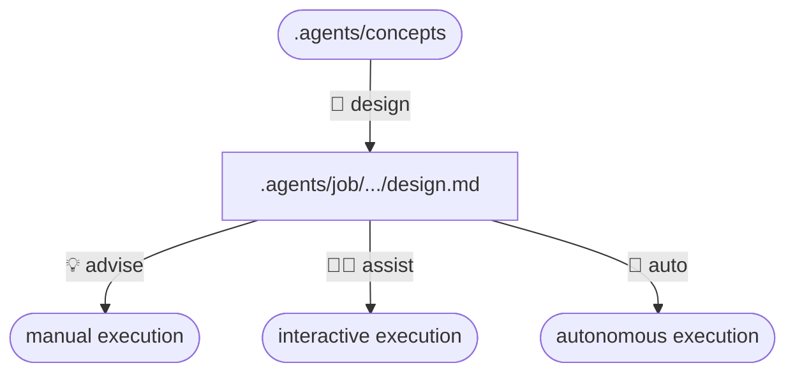

# Usage

AutoCode is used from inside OpenCode after the plugin is loaded. It is not a standalone application and does not start a web server or expose a local URL. It registers managed agents, slash commands, generated skills, and tools.

### Primary Agents

| Agent | Purpose |
| ---------- | --------------------------------------------------------- |
| 💡 `advise` | Research topics, answer questions, and guide manual work. |
| 📐 `design` | Design and propose solutions. |
| 🤖 `auto` | **Autonomously** solve problems. |
| 🧑‍💻 `assist` | Assist **interactively** to solve problems. |

### Concept, Design, and Execution Workflow

```mermaid
flowchart TD
  Concepts([.agents/concepts])
  Concepts -- 📐 design --> Design[.agents/job/.../design.md]
  
  Design -- 💡 advise --> Advise([manual execution])
  Design -- 🧑‍💻 assist --> Assist([interactive execution])
  Design -- 🤖 auto --> Auto([autonomous execution])
  
```

1. Use `/job-concepts` to save an early idea under `.agents/concepts`, then run `/job-design` to investigate and select a solution.
2. `autocode_design_write` saves the selected design at `.agents/jobs/YYYY-MM-DD_hh-mm-ss_{title}/design.md`; timestamp is UTC and workspace remains in place.
3. `autocode_design_read` reads a design by `job_name` or current session title and selects newest matching timestamped workspace.
4. Select `/job-execute` for `auto` execution or `/job-facilitate` for `assist` execution. `/job-facilitate` is an assist-mode selector, not a workspace state.

### Hybrid Workflow

Combinations of Autonomous and Assisted Workflows are also possible as you can switch any time between `auto` and `assist` agents.

For example you may start in `assist` mode and then later when you get busy, switch to `auto` mode so that agent can continue with your plan without your presence or vice versa.

### Commands

| Command              | Purpose                                                                                   |
| -------------------- | ----------------------------------------------------------------------------------------- |
| `/autocode-install`  | Start AutoCode installation checks and remediation.                                       |
| `/assist`            | Same assist session as `/new-assist`.                                                     |
| `/new-advise`        | Create new 💡 advise session to research topics, answer questions, and guide manual work. |
| `/new-design`        | Create new 📐 design session to design solution to problem.                               |
| `/new-auto`          | Create new 🤖 auto session to autonomously solve problems.                                |
| `/new-assist`        | Create new 🧑‍💻 assist session to semi-autonomously assist with problems/improvements.      |
| `/new-fix`           | Create new session to fix errors or requested issues.                                     |
| `/job-concepts`      | Save concepts under `.agents/concepts/`.                                                  |
| `/job-design`        | Design a solution from a concept or current context.                                     |
| `/job-execute`       | Select `auto` execution for current design workspace.                                    |
| `/job-facilitate`    | Select `assist` execution for current design workspace.                                  |

### Concepts and Design Workspaces

Concepts are early Markdown descriptions saved in `.agents/concepts/`. `/job-concepts` remains available for creating them.

`autocode_design_write` creates durable design workspaces at `.agents/jobs/YYYY-MM-DD_hh-mm-ss_{title_dir}/design.md`. The timestamp is UTC, `{title_dir}` is slug derived from current session title, and workspace stays at that path during and after execution.

| Path | Purpose |
| ---- | ------- |
| `.agents/concepts/{label}.md` | Early concept selected by `/job-design`. |
| `.agents/jobs/YYYY-MM-DD_hh-mm-ss_{title_dir}/design.md` | Solution design with problems, impact, expectations, requirements, constraints, and proposal. |
| `.agents/jobs/YYYY-MM-DD_hh-mm-ss_{title_dir}/session.yml` | Optional linked OpenCode session ID. |
| `.agents/jobs/YYYY-MM-DD_hh-mm-ss_{title_dir}/sandboxes/{sandbox_name}` | Canonical per-job sandbox storage. |

`autocode_design_read` accepts an optional `job_name`; without one it derives name from current session title and reads newest matching timestamped design. `autocode_session_create` bypasses design lookup when `prompt` is nonblank. With blank `prompt`, it derives current-title slug and uses newest matching `design.md`; no match returns retriable error instructing caller to provide nonblank `prompt`.

### Sandbox ownership

Canonical sandbox path is exactly `.agents/jobs/YYYY-MM-DD_hh-mm-ss_{title_dir}/sandboxes/{sandbox_name}`. Resolve current job first from its linked session; otherwise use deterministic newest timestamped workspace matching current session-title slug. No owner returns an error before filesystem mutation or process spawn.

All sandbox access, list, create, copy, and delete operations stay in resolved current job. Never look up sandbox names across jobs: same `{sandbox_name}` may exist independently in multiple jobs. Never access, fall back to, migrate, scan, delete, or write legacy `.agents/sandboxes`; legacy data remains untouched and inaccessible.

### Root Session Heading Contract

Only `advise`, `assist`, and `auto` assistant turns are eligible. First eligible text line must be `# {emoji} {title}`. Matching generated parenthesized postfix replaces; other headings append as postfix. Title-update failure is advisory.

### Database inspection

AutoCode can inspect environment-configured databases through read-only tools and the hidden database specialist agent. This capability is intended for safe lookup and analysis, not schema changes, joins across multiple tables, or write operations.

- All database access is read-only.
- Reads are limited to a single table at a time.
- Identifiers must be simple schema, table, or field names.
- Supported filter operators are `=`, `!=`, `<`, `<=`, `>`, `>=`, `like`, `in`, and `is_null`.

## See also

- [Configuration](configuration.md) — database and SSH environment variables.
- [Terminology](terminology.md) — concept, design, and workspace terms.
