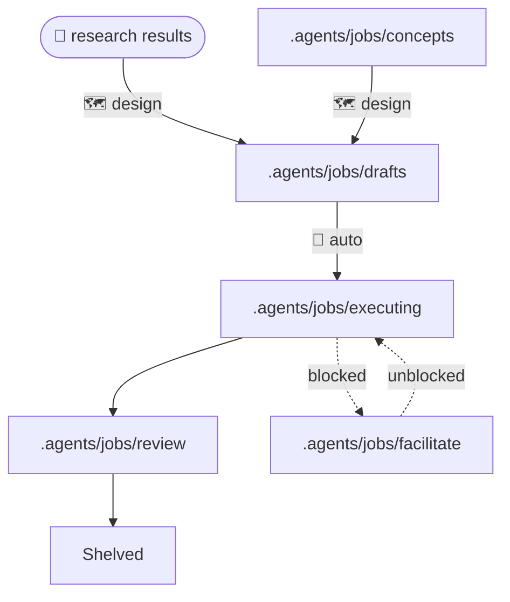
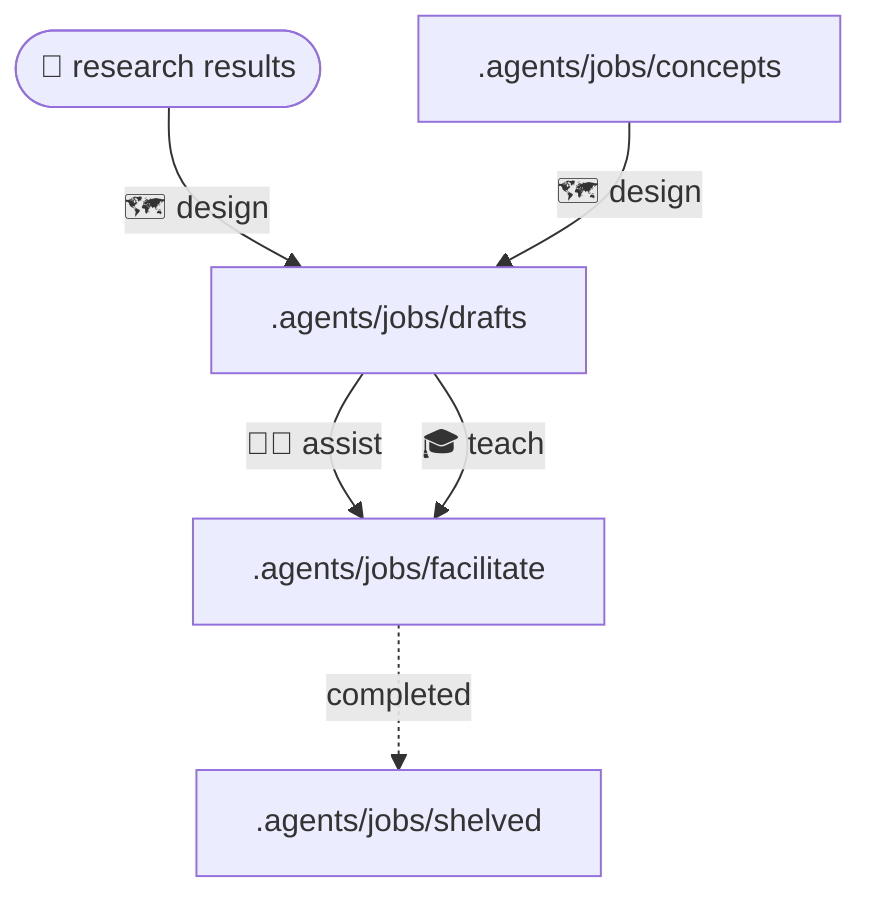

# Usage

AutoCode is used from inside OpenCode after the plugin is loaded. It is not a standalone application and does not start a web server or expose a local URL. It registers managed agents, slash commands, generated skills, and tools.

### Primary Agents

|     | Agent      | Purpose                                                                     |
| --- | ---------- | --------------------------------------------------------------------------- |
| 🔎   | `research` | Gathers evidence and produces Research Reports.                             |
| 🗺️   | `design`   | Creates solution plans from conversation and optional Research Report data. |
| 🤖   | `auto`     | Autonomously executes drafted jobs from solution plans.                     |
| 🧑‍💻   | `assist`   | Interactively executes immediate tasks with human control                   |
| ✏️   | `edit`     | Make fast, targeted edits directly in-session without spawning subagents    |
| 🎓   | `teach`    | Find answer and teach how to manually fix problems                          |

### Autonomous Job Workflow

```mermaid
flowchart TD
  Research([🔎 research results]) --🗺️ design--> Drafts[.agents/jobs/drafts]
  Concepts[ .agents/jobs/concepts] --🗺️ design--> Drafts
  Drafts --🤖 auto --> Executing[.agents/jobs/executing]
  Executing --> Review[.agents/jobs/review]
  Review --> Shelved
  Executing -.blocked.-> Facilitate[.agents/jobs/facilitate]
  Facilitate -.unblocked.-> Executing
```

1. 🔎 `research` possibilities or create concept md document in `.agents/jobs/concepts`.
2. Run `/job-design` to investigate feasibility, design best approach and draft solution plan in `.agents/jobs/drafts/{job_name}/plan.md`.
3. Revise draft `plan.md` before autonomous handover.
4. Run `/job-execute` to execute `plan.md` fully autonomously.
5. The job will move automatically to `.agents/jobs/executing` while busy, `.agents/jobs/facilitate` if blocked and then to `.agents/jobs/review` when done.
6. When done, do manual testing, then:
   - *Reject* job with `/job-shelve` to shelve (clean up files) job or
   - *Accept* job with `/commit` to commit to git and shelve.

### Assisted Workflow

```mermaid
flowchart TD
  Research([🔎 research results]) --🗺️ design--> Drafts[.agents/jobs/drafts]
  Concepts[ .agents/jobs/concepts] --🗺️ design--> Drafts
  Drafts --🧑‍💻 assist --> Facilitate[.agents/jobs/facilitate]
  Drafts --🎓 teach --> Facilitate
  Facilitate -.completed.-> Shelved[.agents/jobs/shelved]
```

1. 🔎 `research` possibilities or create concept md document in `.agents/jobs/concepts`.
2. Run `/job-design` to investigate feasibility, design best approach and draft solution plan in `.agents/jobs/drafts/{job_name}/plan.md`.
3. Run one of these commands:
   - `/job-facilitate`: Execute `plan.md` semi-autonomously with assistant (you make decisions, assistant do work).
   - `/job-teach`: Execute `plan.md` manually with guiding teacher.
5. If `/job-execute` was chosen, then job will move automatically to `.agents/jobs/executing` while busy and then to `.agents/jobs/review` when done.
6. When done, do manual testing, then:
   - *Reject* job with `/job-shelve` to shelve (clean up files) job or
   - *Accept* job with `/commit` to commit to git and shelve.

### Hybrid Workflow

Combinations of Autonomous and Assisted Workflows are also possible as you can switch any time between `auto`, `assist`, `teach` agents.

For example you may start in `assist` mode and then later when you get busy, switch to `auto` mode so that agent can continue with your plan without your presence or vice versa.

### Job Commands

Normal prompts can start or resume work. Slash commands are convenience wrappers around same lifecycle.

| Command                    | Purpose                                                                                     |
| -------------------------- | ------------------------------------------------------------------------------------------- |
| `/job-concepts`            | Saves concept Markdown files in `.agents/jobs/concepts/`.                                   |
| `/job-design`              | Design draft plan to `.agents/jobs/drafts/{name}/`.                                         |
| `/job-execute`             | Moves reviewed draft to `.agents/jobs/executing/{name}/` and starts 🤖 auto agent.             |
| `/job-facilitate`          | Moves reviewed draft to `.agents/jobs/facilitate/{name}/` and start 🧑‍💻 assist agent.     |
| `/job-teach`          | Moves reviewed draft to `.agents/jobs/facilitate/{name}/` and start 🎓 teach agent.               |
| `/job-shelve`              | Moves reviewed job to `.agents/jobs/shelve/{name}/`.                                        |

### Modes

| Command         | Purpose                                                                       |
| --------------- | ----------------------------------------------------------------------------- |
| `/research`     | Switch to 🔎 research mode to answer question at hand.                           |
| `/design`       | Switch to 🗺️ design mode to design solution to problem.                          |
| `/auto`         | Switch to 🤖 auto mode to autonomously solve problems (according to design plan) |
| `/assist`       | Switch to 🧑‍💻 assist mode to semi-autonomously assist with problems/improvements. |
| `/teach`        | Switch to 🎓 teach mode to teach you how to solve problems (provide commands).   |

### Documentation Commands

| Command             | Purpose                                                                |
| ------------------- | ---------------------------------------------------------------------- |
| `/docs`             | Document all recent changes.                                           |
| `/docs-code`        | Documents recent technical architecture and code design decisions.     |
| `/docs-conventions` | Documents recent naming conventions and project terminology.           |
| `/docs-prd`         | Documents recently updated product requirements and user roles.        |
| `/docs-ux`          | Documents recently updated UX flows, navigation, and styling patterns. |
| `/init`             | Alias to `/docs`.                                                      |

### Utility Commands

| Command             | Purpose                                                                    |
| ------------------- | -------------------------------------------------------------------------- |
| `/autocode-version` | Prints currently installed versions of OpenCode and AutoCode.              |
| `/author-article`   | Authors a professional article or report from the supplied context.        |
| `/commit`           | Commit changes to Git repo and shelve job.                                 |
| `/context`          | Report current session context.                                            |
| `/explain`          | Explain code or project context.                                           |
| `/fix`              | Fix errors or requested issues.                                            |
| `/git-conflict`     | Handles git merge conflict work through the git conflict subagent.         |
| `/repeat-as-md`     | Repeats the last response inside a fenced Markdown code block.             |
| `/repeat-as-wiki`   | Repeats the last response in Atlassian Wiki Markup for Jira-style pasting. |
| `/report`           | Provide detailed report of recent research or actions.                     |
| `/resume`           | Resumes an interrupted session by calling the resume tool.                 |
| `/shelve`           | Clean up sandbox files (if any). Alias for `/job-shelve`.                  |
| `/tests`            | Generate or improve tests.                                                 |

### Job files

Jobs are stored in `.agents/jobs/{status}/{job_name}/`. Valid statuses are `drafts`, `executing`, `facilitate`, `review`, and `shelved`.

| Path          | Purpose                                                                                       |
| ------------- | --------------------------------------------------------------------------------------------- |
| `concept.md`  | Copy of the concept used to design the plan.                                                  |
| `plan.md`     | Solution plan covering problems, requirements, constraints, risks, and the selected proposal. |
| `session.yml` | Persists the OpenCode session ID linked to this job (fallback identity lookup).               |

### Database inspection

AutoCode can inspect environment-configured databases through read-only tools and the hidden database specialist agent. This capability is intended for safe lookup and analysis, not schema changes, joins across multiple tables, or write operations.

- All database access is read-only.
- Reads are limited to a single table at a time.
- Identifiers must be simple schema, table, or field names.
- Supported filter operators are `=`, `!=`, `<`, `<=`, `>`, `>=`, `like`, `in`, and `is_null`.

## See also

- [Configuration](configuration.md) — database and SSH environment variables.
- [Terminology](terminology.md) — job lifecycle terms.
