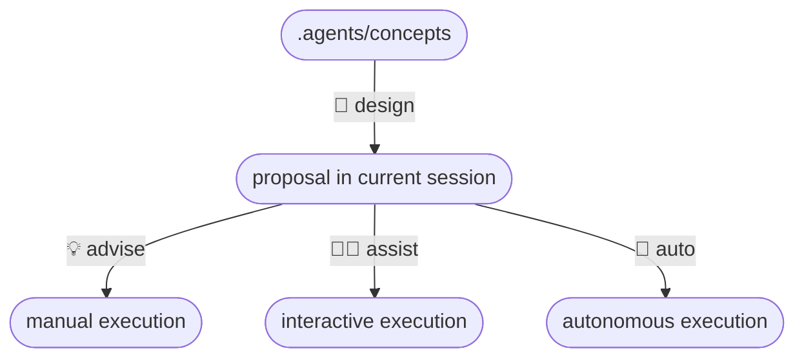

# Usage

AutoCode is used from inside OpenCode after the plugin is loaded. It is not a standalone application and does not start a web server or expose a local URL. It registers managed agents, slash commands, generated skills, and tools.

### Primary Agents

| Agent      | Purpose                                                   |
| ---------- | --------------------------------------------------------- |
| 💡 `advise` | Research topics, answer questions, and guide manual work. |
| 📐 `design` | Design and propose solutions.                             |
| 🤖 `auto`   | **Autonomously** solve problems.                          |
| 🧑‍💻 `assist` | Assist **interactively** to solve problems.               |
| 🕵️ `spy`    | Primary, visible, read-only safety review and guidance.   |

### Concept, Design, and Execution Workflow


```mermaid
flowchart TD
  Concepts([.agents/concepts])
  Concepts -- 📐 design --> Design([proposal in current session])

  Design -- 💡 advise --> Advise([manual execution])
  Design -- 🧑‍💻 assist --> Assist([interactive execution])
  Design -- 🤖 auto --> Auto([autonomous execution])
```

`spy` cannot receive session handoff; use it directly.

### Behavioural Differences

| Agent    | Investigations | Next Action | Apply Changes |
| -------- | -------------- | ----------- | ------------- |
| 💡 advise | Autonomous     | Interactive | Human         |
| 🧑‍💻 assist | Autonomous     | Interactive | AI*           |
| 🤖 auto   | Autonomous     | Autonomous  | AI*           |

*Except dangerous tasks.

### Hybrid Workflow

Combinations of Autonomous and Assisted Workflows are also possible as you can switch any time between `auto` and `assist` agents.

For example you may start in `assist` mode and then later when you get busy, switch to `auto` mode so that agent can continue with your plan without your presence or vice versa.

### Commands

| Command             | Purpose                                                                                  |
| ------------------- | ---------------------------------------------------------------------------------------- |
| `/autocode-install` | Start AutoCode installation checks and remediation.                                      |
| `/assist`           | Same assist session as `/new-assist`.                                                    |
| `/new-advise`       | Create new 💡 advise session to research topics, answer questions, and guide manual work. |
| `/new-design`       | Create new 📐 design session to design solution to problem.                               |
| `/new-auto`         | Create new 🤖 auto session to autonomously solve problems.                                |
| `/new-assist`       | Create new 🧑‍💻 assist session to semi-autonomously assist with problems/improvements.      |
| `/new-spy`          | Create new 🕵️ spy session from current context for read-only safety review and guidance.   |
| `/new-fix`          | Create new session to fix errors or requested issues.                                    |
| `/job-concepts`     | Save concepts under `.agents/concepts/`.                                                 |
| `/job-design`       | Design a solution from a concept or current context.                                     |
| `/job-execute`      | Select `auto` execution for current design workspace.                                    |
| `/job-facilitate`   | Select `assist` execution for current design workspace.                                  |

### Concepts and Design Workspaces

Concepts are early Markdown descriptions saved in `.agents/concepts/`. `/job-concepts` remains available for creating them.

| Path                                           | Purpose                                                                                       |
| ---------------------------------------------- | --------------------------------------------------------------------------------------------- |
| `.agents/concepts/{label}.md`                  | Early concept selected by `/job-design`.                                                      |
| `.agents/jobs/{name}/design.md`                | Solution design with problems, impact, expectations, requirements, constraints, and proposal. |
| `.agents/jobs/{name}/session.yml`              | Optional linked OpenCode session ID.                                                          |
| `.agents/jobs/{name}/sandboxes/{sandbox_name}` | Canonical per-job sandbox storage.                                                            |

`autocode_session_create` uses a nonblank `prompt` directly. With a blank `prompt`, it derives the current-title slug and uses the newest matching `design.md`; no match returns a retriable error instructing the caller to provide a nonblank `prompt`.

### Sandbox ownership

Canonical sandbox path is exactly `.agents/jobs/{name}/sandboxes/{sandbox_name}`. Resolve current job first from its linked session; otherwise use deterministic newest timestamped workspace matching current session-title slug. No owner returns an error before filesystem mutation or process spawn.

All sandbox access, list, create, copy, and delete operations stay in resolved current job. Never look up sandbox names across jobs: same `{sandbox_name}` may exist independently in multiple jobs. Never access, fall back to, migrate, scan, delete, or write legacy `.agents/sandboxes`; legacy data remains untouched and inaccessible.

### Managed Script Workflow

Each managed script project belongs to its current job:

```text
.agents/jobs/{name}/scripts/
├── AGENTS.md
├── package.json
├── package-lock.json
├── node_modules/
├── src/
│   └── *.mjs
├── logs/
└── services/                  # when applicable
```

Log filenames vary, but all managed logs remain in current job's `scripts/logs/`. Agents in same job reuse one scripts project; different jobs or sessions resolve separate job roots. Missing or ambiguous job ownership rejects the operation. Script-project files persist across managed tool calls until whole-job cleanup.

`scripts/src` is the canonical managed `sourceRoot`; runtime fixes it and callers cannot supply another source root. `autocode_script_run` and `autocode_script_service` with `action` `start` accept entries relative to it, such as `task.mjs` or `nested/task.mjs`. Entries reject `src/` prefixes, absolute paths, backslashes, traversal, symlink escapes, broken symlinks, non-files, and extensions other than `.mjs`.

Managed processes use `scripts` root as cwd. `AUTOCODE_SCRIPT_ROOT` is `scripts` root, and `AUTOCODE_WORKSPACE_ROOT` remains unchanged. Dependency specs accept npm registry versions, ranges, and tags only; `file:`, `link:`, relative or absolute paths, URLs, Git sources, and filesystem or network archive sources are rejected.

### Root Session Heading Contract

Only `advise`, `assist`, and `auto` assistant turns are eligible. First eligible text line must be `# {emoji} {title}`. Matching generated parenthesized postfix replaces; other headings append as postfix. Title-update failure is advisory.

### Database inspection

AutoCode can inspect environment-configured databases through read-only tools and the hidden database specialist agent. This capability is intended for safe lookup and analysis, not schema changes, joins across multiple tables, or write operations.

- All database access is read-only.
- Reads are limited to a single table at a time.
- Identifiers must be simple schema, table, or field names.
- Supported filter operators are `=`, `!=`, `<`, `<=`, `>`, `>=`, `like`, `in`, and `is_null`.

## See also

- [Configuration](configuration.md) — database and SSH environment variables.
- [Terminology](terminology.md) — concept, design, and workspace terms.
